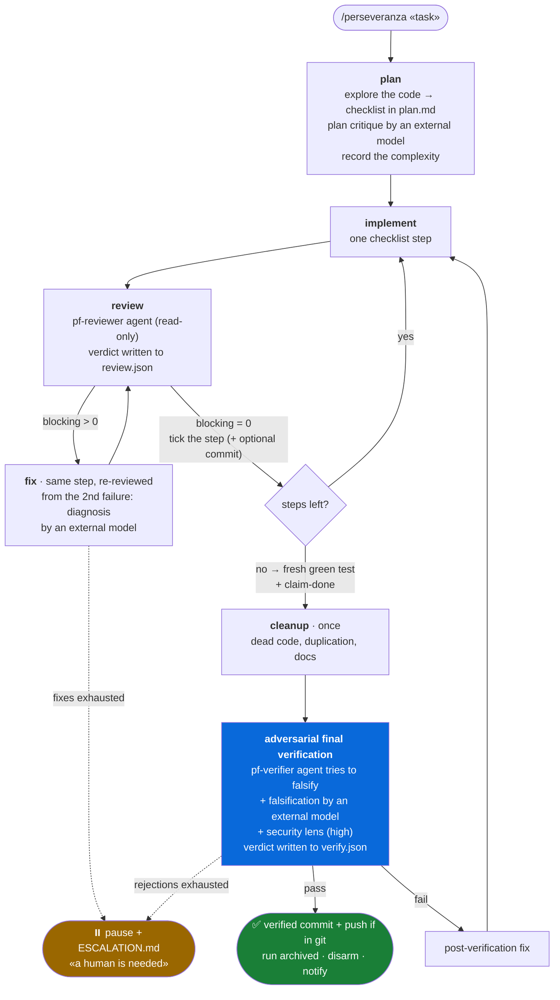

# Perseveranza


*[Versione italiana](README.md)*

**Give Claude Code a task and let it work until it is really done.**

Perseveranza is an autonomous feedback loop: Claude explores the code, writes a plan,
implements one step at a time, has every step reviewed by a clean-context subagent, and may
call itself "done" only by passing an independent adversarial final verification. A desktop
notification tells you when the project is complete or when you are needed.

The engine is a **dormant Stop hook**: it does nothing until you arm it with
`/perseveranza`, so it never interferes with normal chats. Everything runs on Node.js, the
same runtime as Claude Code, with no other dependency.

## The loop at a glance



Three principles drive the design:

1. **Closed loop, not a metronome.** The hook does not rotate phases blindly: it routes on
   outcomes. A failed review sends back to the fix of the same step; a passed one advances
   the checklist. The transition table is data in the code (`explain` verb) and is
   reproduced [below](#the-transition-table).
2. **Cheap inner loop, strict exit gate.** The per-step review is light; the expensive check
   (adversarial verification, security, external model) runs once, when Claude declares the
   work done. Declaring done does not close the loop: **it triggers the check**.
3. **Proofs, not words.** The script itself runs the tests (`test` verb: real exit code plus
   a fingerprint of the work tree), and `claim-done` is accepted only with a fresh green run
   on code untouched afterwards. Review and verification verdicts are schema-checked JSON
   files written by the reviewers and consumed by the hook; a missing or malformed outcome
   is never a promotion. The git closure is verified on facts.

## Installation (plugin, recommended)

Inside Claude Code, two commands, **one at a time**:

```
/plugin marketplace add https://github.com/ilmondovero/perseveranza
```

```
/plugin install perseveranza@perseveranza
```

Use the **full HTTPS URL**: the short form clones over SSH and fails on machines without
keys. Updates come from the `/plugin` panel.

### Requirements

- [Claude Code](https://claude.com/claude-code) and Node.js ≥ 20 (it ships with it).
- No dependency on other plugins: the loop's agents (`pf-reviewer`, `pf-verifier`,
  `pf-executor`) are included.
- Optional, auto-detected for the second opinion: external model CLIs (`codex`, `agy`,
  `grok`, `cursor-agent`, `claude` itself as a clean-context counter-check) and/or
  `ollama-cloud` via API (key in `~/.perseveranza/config.json` or `OLLAMA_API_KEY`).
- Desktop notifications (optional, silent fallback): BurntToast on Windows, `osascript` on
  macOS, `notify-send` on Linux.

### Manual installation (alternative)

```bash
git clone https://github.com/ilmondovero/perseveranza.git
cd perseveranza
node install.mjs
```

Copies into `~/.claude/perseveranza/` exactly the files listed in `manifest.mjs`, installs
the command and the agents and registers the Stop hook in `~/.claude/settings.json`
(idempotent, with backup; removes v1 installs). Uninstall: `node install.mjs --uninstall`.
**Never use both modes at once**: two Stop hooks would drive the same loop.

## Usage

```
/perseveranza implement feature X                     # adaptive budget from the plan
/perseveranza rewrite module Y --max 40               # explicit iteration cap
/perseveranza feature Z --commit                      # atomic commit after every validated step
/perseveranza quick fix --external off                # no external models
/perseveranza feature W --no-git-finish               # no commit+push at the end
/perseveranza feature V --no-push                     # local commit, no push
/perseveranza feature K --approve-plan                # pause after the plan: you approve with resume
/perseveranza feature J --budget-tokens 400000        # token cap in addition to iterations
/perseveranza feature H --lang it                     # injected instructions in Italian
```

Claude writes the plan to `.omc-loop/plan.md`, records the complexity, and from there the
loop runs by itself: at the end of every response the Stop hook injects the next phase's
instruction. The **language** of the instructions is English by default; `--lang it`,
`PERSEVERANZA_LANG=it`, `"lang": "it"` in the config or an Italian locale (`LANG`) enable
the bundled Italian pack (`packs/it.json`), which covers every instruction.

### The verbs

```
node "<root>/src/cli/omc-loop.mjs" <verb>
```

| verb | what it does |
|---|---|
| `arm "<task>" [flags]` | arms the loop; **refuses** when already armed (`--force` to overwrite) |
| `test -- <cmd>` | runs the suite itself: real exit code + work-tree fingerprint |
| `report pass\|fail` | outcome of the current phase, only when the reviewer could not write the verdict |
| `complexity low\|medium\|high` | routes the review, verification and implementation models |
| `claim-done` | declares the project complete → cleanup + final verification |
| `ask <provider> <slot> -- <prompt>` | opinion of an external model, saved in `external-<slot>-*.md` |
| `pause` / `resume` | suspend / resume (resume resets retries and removes the escalation) |
| `status` | readable summary (`--json` for the raw state) |
| `history [--tail N]` | the run journal, readable |
| `explain [--markdown]` | transition table and next outcomes from the current phase |
| `providers [list\|check\|enable]` | external providers; `check` probes liveness and disables dead ones |
| `runs [list\|show <id>]` | archive of past runs (`~/.perseveranza/runs/`) |
| `prompts [keys\|show\|layers\|validate]` | the prompt pack and its overrides |
| `config` / `hud on\|off` | local configuration / statusline |
| `disarm [--no-archive]` | stops and removes the loop (the run is archived) |

## The transition table

Generated from the code with `npm run explain -- --markdown`; a test compares it with this
copy. `any` = from any phase; `unchanged` = the phase stays.

<!-- transitions:start -->
| phase | outcome | next | action |
|---|---|---|---|
| plan | no-plan | plan | `plan-write`; asked once; a second miss still goes to implement |
| plan | approval | plan | `plan-approval`; pause; --approve-plan, once |
| plan | ready | implement | `implement-first`; adaptive budget set here when --max was not given |
| implement | always | review | `review-delegate`; drops a stale review.json |
| review | pass | implement | `review-advance`; retries reset |
| review | fail | implement | `review-fix`; retries++; external diagnosis from the 2nd fix |
| review | fail-limit | review | pause + escalation (fixes exhausted) |
| review | missing | review | `review-missing-outcome`; asked once |
| review | missing-twice | implement | `review-fix`; counts as a failed review |
| any | claim-open | unchanged | `claim-open-steps`; claim-done refused: unchecked steps |
| any | claim-no-test | unchanged | `claim-no-fresh-test`; claim-done refused: no fresh green test |
| any | claim-stale | unchanged | `claim-stale-test`; claim-done refused: code changed after the test |
| any | claim-first | cleanup | `cleanup`; once per run |
| any | claim-again | final-verify | `final-verify`; drops a stale verify.json |
| cleanup | always | final-verify | `final-verify` |
| final-verify | pass | git-finish | commit+push within the deadline, archive, disarm, notify |
| final-verify | fail | implement | `verify-postfix`; finalFails++ |
| final-verify | fail-limit | final-verify | pause + escalation |
| final-verify | missing | final-verify | `verify-missing-outcome`; asked once |
| final-verify | missing-twice | implement | `verify-postfix`; counts as a failed verification |
| git-finish | retry | git-finish | after resume: retry the closure |
| any | budget | disarm | iterations or tokens exhausted: archive, disarm, notify |
| any | kill | disarm | STOP file or OMC_LOOP_KILL: before any other check |
| any | unknown-phase | plan | `phase-recovered`; tampered state: restart from the plan |
<!-- transitions:end -->

## The contract: who owns what

`.omc-loop/state.json` (schema v2) is grouped by owner:

- **the hook** writes `phase`, `counters`, `flags`, `owner`, `usage`;
- **the verbs** write `signals` (`report`, `claim-done`, `pause`/`resume`) and `lastTest`;
- **`arm`** writes `options` and `limits` (the adaptive budget touches `maxIterations` once,
  after the plan, only when `--max` was not explicit).

A v1 (1.x) state found by the hook is migrated at the first fire. The other loop files:
`plan.md` and `notes.md` (Claude's), `review.json` / `verify.json` (reviewer artifacts,
consumed on read), `journal.jsonl` (one line per event), `external-*.md` (external
opinions), `ESCALATION.md` (hand-off when the loop stops).

## Model routing by complexity

| phase | low | medium | high |
|---|---|---|---|
| code review (subagent) | haiku | sonnet | opus |
| final verification (subagent) | sonnet | opus | opus |
| implement | in session | in session | delegated to `pf-executor` with opus |

With `high` the final verification adds a security lens.

## Budget, kill switch, escalation

- **Iterations**: `--max N`, otherwise adaptive after the plan (`8 + 3 × steps`, at most
  60). The exit ramp (cleanup, verification, closure) gets 3 iterations of grace.
- **Tokens**: `--budget-tokens N` measures real tokens from the session transcript
  (best-effort: when the transcript is unreadable the cap stays on iterations).
- **Fixes per step**: `--max-retries N` (default 3) fixes really granted; on the next
  rejection the loop pauses and writes `ESCALATION.md`.
- **Kill switch**: `.omc-loop/STOP` (file) or `OMC_LOOP_KILL=1`: at the first Stop the loop
  disarms, before any other check and from any session.
- **Timeouts**: hook 120 s (`OMC_HOOK_TIMEOUT_MS`, the push has a 45 s cap inside the
  deadline), tests 30 min (`OMC_TEST_TIMEOUT_MS`), external opinion 3 min
  (`OMC_ASK_TIMEOUT_MS` or `providers.timeouts` in the config), session takeover 6 h
  (`OMC_SESSION_TAKEOVER_MS`).

Details in [docs/loop-budget.md](docs/loop-budget.md).

## Closure and run archive

After a passed verification the hook runs `git add -A` (never `.omc-loop/`), commits
`perseveranza: <task>` and pushes, within the hook deadline, and verifies **on facts** that
both happened (clean tree, HEAD not ahead of upstream). If the closure is not confirmed the
loop pauses in phase `git-finish` with the reason; `resume` retries. The commit body notes
files already dirty at arm and the absence of a successful external opinion at the gate.

Then `.omc-loop/` is **archived** into `~/.perseveranza/runs/<project>/<timestamp>/` with a
`summary.json` (outcome, iterations, tokens, verdicts, tests, opinions): `runs list`,
`runs show <id>`. `disarm`, the kill switch and budget exhaustion archive as well.

## Prompt pack

Phase instructions are overridable templates (`src/core/prompts.mjs`, `{{...}}`
placeholders). Layers, strongest first: `OMC_PROMPT_PACK=<file>` → `.omc-loop/prompts.json`
→ `packs/<lang>.json` → defaults. A pack changes *what is said*, never the routing; the
hook always prepends the progress header; a broken pack falls back to the next layer and is
journaled. `prompts validate <file>` checks keys and placeholders; `prompts layers` shows
the active layers.

## External models

Registry in `src/providers/registry.mjs`: `codex`, `agy`, `grok`, `cursor`, `claude` (CLI)
and `ollama-cloud` (API). The prompt never goes through a shell (stdin or pure argv);
auto-approving CLIs run in a temporary directory. `providers check` sends a trivial prompt
to every detected provider and disables the dead ones in the config, with date and reason
(`providers enable <id>` to undo). A policy refusal or a timeout is never a finding: the
binding verdict stays `verify.json`.

Local config in `~/.perseveranza/config.json` (never in the repo):

```json
{ "lang": "it",
  "ollama": { "apiKey": "<key>", "model": "glm-5.2,kimi-k2.7-code" },
  "providers": { "disabled": ["codex"], "timeouts": { "ollama-cloud": 300000 } } }
```

## Progress (HUD)

The header of every injected instruction shows phase, step bar, iterations and tokens.
`hud on` puts the same line in the Claude Code statusline, **composing** with the existing
one (saved and restored by `hud off`).

## Parallel tasks

N `git worktree`s = N independent `.omc-loop/` = N parallel loops, each claimed by the first
session that fires. Each needs an upstream branch (or `--no-push`); `.omc-loop/STOP` is
per worktree, `OMC_LOOP_KILL` is global.

## Development

```bash
npm test                 # everything: unit (pure core) + verbs + e2e (hook and git) + packaging
npm run test:unit        # core only, no processes
npm run explain -- --markdown
```

CI runs on Ubuntu, macOS and Windows with Node 20 and 22. Invariants and traps for
reviewers: [docs/REVIEW-NOTES.md](docs/REVIEW-NOTES.md). Decision history:
[CHANGELOG.md](CHANGELOG.md). The plan v2 comes from: [docs/PIANO-V2.md](docs/PIANO-V2.md)
(Italian). The bench that evolves the prompt pack: [bench/README.md](bench/README.md).

## Migrating from 1.x

- Same `.omc-loop/` path, same verbs: the `/perseveranza` command keeps working.
- An armed 1.x state is migrated at the first Stop (`migrate` line in the journal).
- Instructions are English by default: for Italian use `--lang it` or `"lang": "it"` in the
  config (the command does it by itself when the task is written in Italian).
- Removed pack keys: `review-advance-no-outcome`, `verify-failed-no-outcome` (a twice-missing
  outcome is now a rejection); new: `claim-stale-test`.
- `history.log` → `journal.jsonl` (`history` verb); the manual install lives in
  `~/.claude/perseveranza/` (rerun `node install.mjs`, which removes the v1 files).

## Uninstall

Plugin: from the `/plugin` panel. Manual: `node install.mjs --uninstall`. Run `hud off`
first if it is on.
