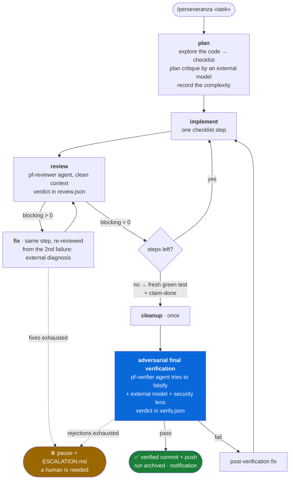

<div align="center">

# Perseveranza

**Give Claude Code a task and let it work until it is really done.**


*[Italiano](README.md)*

</div>

Perseveranza is a [Claude Code](https://claude.com/claude-code) plugin that turns a request
into an **autonomous feedback loop**: Claude explores the code, writes a plan, implements
one step at a time, has every step reviewed by a clean-context agent, and may call itself
"done" only after an **adversarial final verification** that tries to take the work apart.
At the end you get a verified commit and push, an archive of the run and a desktop
notification. When a human is needed, the loop stops and leaves a written hand-off.

Zero dependencies: it runs on Node.js, the same runtime as Claude Code. Dormant until you
arm it: in normal chats it does not exist.

## In 30 seconds

Inside Claude Code, one command at a time:

```
/plugin marketplace add https://github.com/ilmondovero/perseveranza
```

```
/plugin install perseveranza@perseveranza
```

Then, in the project you want to work on:

```
/perseveranza add pagination to the /orders endpoint, with tests --lang en
```

From here Claude writes the plan to `.omc-loop/plan.md` and the loop runs by itself: at
the end of every response the Stop hook injects the next phase's instruction, with a
progress line on top:

```
[perseveranza v2.0.0 · ▸impl ▰▰▱▱▱ 2/5 · it7/23 · 84k tok] Task: add pagination…
```

When it is done you get the notification "Project finished and verified · commit+push confirmed".

## Why it exists

An agent working alone tends to **declare itself done too early**: the common case works,
the edge cases do not, the tests "pass" in its head. A former Meta principal who put a
validator in front of his agent measured that **68% of the changes** contained bugs to fix
before the PR
([Kun Chen, `no-mistakes`](https://blog.bytebytego.com/p/an-ex-meta-l8s-agentic-engineering)).

Perseveranza is built on three principles:

1. **Closed loop, not a metronome.** Phases do not rotate blindly: a failed review sends
   back to the fix of the same step, a passed one advances the checklist. The routing is a
   table in the code, not a habit of the model.
2. **Cheap inner loop, strict exit gate.** The per-step review is light. The expensive
   check (adversarial verification, security lens, external model) runs once, when Claude
   declares the work done. Declaring done does not close the loop: **it triggers the check**.
3. **Proofs, not words.** The script runs the tests, Claude does not narrate them. Verdicts
   are JSON files written by the reviewers. The git closure is verified on facts. A missing
   outcome is never a promotion.

## How it works



| phase | who | what it produces |
|---|---|---|
| **plan** | Claude, after exploring the code | `plan.md` as a checklist, complexity recorded |
| **implement** | Claude (or `pf-executor` with opus when complexity is high) | one step, with its edge cases |
| **review** | `pf-reviewer`, clean context, model by complexity | `review.json` with `blocking` and findings |
| **fix** | Claude, on the same step | the fix, which goes back to review |
| **cleanup** | Claude, once | dead code and duplication removed, docs updated |
| **final verification** | `pf-verifier`, assuming the work is wrong | `verify.json` with `pass` and findings |
| **closure** | the Stop hook, not Claude | commit, push, run archive, notification |

The reviewers' model follows the complexity Claude records: `haiku` / `sonnet` / `opus`
for the review, `sonnet` / `opus` / `opus` for the final verification; with `high` the
verification adds a security lens.

## The guarantees

- **The script runs the test.** The `test` verb launches the suite and records the real
  exit code plus a fingerprint of the work tree. `claim-done` is accepted only with a green
  run for the current tree: in the same iteration, or from an earlier one when the code did
  not change since (a change confined to documentation files does not count).
- **The suite runs once per tree, not once per agent.** `test --if-needed` does not rerun a
  suite whose green is already recorded for the same tree, and every phase receives the
  current "test proof", so Claude and its subagents run targeted tests instead of repeating
  the whole suite out of caution. The verb also records which tests failed and flags a red
  that does not reproduce on the same tree (a flaky test, not a bug).
- **A consumed verdict is not lost.** `review.json` and `verify.json` are renamed to
  `review-<n>.json` / `verify-<n>.json` when the loop reads them: the fix phase rereads the
  findings there instead of asking the reviewer again.
- **A stop that changed nothing does not advance.** When the work tree is identical to the
  one at the previous stop and no test was recorded (typically a subagent still running when
  the turn ended), the loop asks once to finish the step instead of sending nothing to
  review.
- **Verdicts have a schema.** `review.json` and `verify.json` are validated; when the
  declared verdict and the findings disagree the stricter reading wins; a malformed or
  missing file counts as a rejection, in the review and at the final gate alike.
- **The git closure is verified on facts.** Clean work tree and HEAD not ahead of upstream,
  within the hook deadline. If it cannot be confirmed the loop stops in `git-finish` and
  tells you what is missing; `resume` retries. `.omc-loop/` never ends up in the commit.
- **Nothing is lost.** At the end of a run `.omc-loop/` (journal, plan, notes, external
  opinions) is archived in `~/.perseveranza/runs/` with a `summary.json`: `runs list`,
  `runs show`.
  If archival fails, files stay in `.omc-loop` and the loop is disarmed; `status` explains
  recovery. Fix the destination and run `disarm` to retry archival. Until recovery,
  `arm` refuses to overwrite the retained run.
- **Caps and switches.** Adaptive iterations from the plan or `--max`, real tokens with
  `--budget-tokens`, fixes per step with `--max-retries`. Kill switch from any session:
  the `.omc-loop/STOP` file or `OMC_LOOP_KILL=1`.
- **One loop, one session.** The first session that fires claims the loop; the others do
  not touch it. N `git worktree`s = N parallel loops.

## Commands

The options of `/perseveranza`:

| option | effect |
|---|---|
| `--max N` | iteration cap (otherwise adaptive: `8 + 3 × steps`, at most 60) |
| `--budget-tokens N` | token cap, measured from the session transcript |
| `--max-retries N` | fixes granted per step before the pause (default 3) |
| `--commit` | atomic commit after every validated step |
| `--test "cmd"` | the suite (if you do not pass it, Claude finds it) |
| `--approve-plan` | pause after the plan: you approve with `resume` |
| `--external off` | no comparison with external models |
| `--check` | probe the detected providers now: start only with those that answer |
| `--no-git-finish` / `--no-push` | no commit+push at the end / local commit only |
| `--lang en` | instructions in English (default: Italian) |

The verbs Claude, and you, use to talk to the loop (`node "<root>/src/cli/omc-loop.mjs" <verb>`):

| verb | what it does |
|---|---|
| `status` · `history` · `explain` | readable summary · the run journal · transition table and next outcomes |
| `test [--if-needed] -- <cmd>` | runs the suite and records the proof; `--if-needed` skips it when a green is already recorded for this tree |
| `report` · `complexity` · `claim-done` | Claude's signals to the loop |
| `pause` · `resume` | suspend / resume (resume resets the retries) |
| `ask <provider> <slot> -- <prompt>` | opinion of an external model, saved as an artifact |
| `providers [list\|check\|enable]` | external providers; `check` probes liveness and disables the dead ones |
| `runs [list\|show <id>]` | the archive of runs |
| `prompts [keys\|show\|layers\|validate]` | the prompt pack and its layers |
| `config` · `hud on\|off` | local configuration · statusline |
| `disarm` · `arm --force` | stops the loop (archiving it) · overwrites an armed loop |

## Configuration

`~/.perseveranza/config.json`, never in the repo:

```json
{
  "lang": "en",
  "ollama": { "apiKey": "<key>", "model": "glm-5.3#low,deepseek-v4-flash:0731#none" },
  "providers": { "disabled": ["codex"], "timeouts": { "ollama-cloud": 300000 } }
}
```

(`providers.lastCheck` is written by `providers check` and `arm --check`: it is what `arm`
reports as reachable, as opposed to "installed".)

- **Language.** The injected instructions are in Italian by default (`packs/it.json`).
  Precedence: `--lang` > `PERSEVERANZA_LANG` > `lang` in the config > Italian. The shell
  locale does not count. For English: `--lang en` once, or `"lang": "en"` in the config.
- **External models.** Auto-detected at arm: `codex`, `agy`, `grok`, `cursor`, `claude`
  itself as a clean-context counter-check, `ollama-cloud` via API. The prompt never goes
  through a shell; auto-approving CLIs use a fresh empty temporary directory per invocation,
  with cleanup at the end. A policy refusal or a
  timeout is not a finding: the binding verdict stays the verifier's. A timeout or a network
  error is retried once (`OMC_ASK_RETRIES`) and the message says how to raise the limit
  (`OMC_ASK_TIMEOUT_MS` or `providers.timeouts.<id>`); "detected" at arm means installed,
  not reachable: `arm` reports the outcome of the last `providers check` and with `--check`
  probes the providers right away, dropping for the run those that do not answer.
- **Per-model reasoning** (`ollama-cloud` only). Every entry of `model` can carry its own
  reasoning effort after a `#`: `glm-5.3#low`, `deepseek-v4-flash:0731#none`. Values:
  `high`, `medium`, `low`, `max`, `true`, `false` (aliases for `false`: `none`, `off`);
  without `#` the model default applies. The separator is `#` because the colon already
  separates the ollama tag. An unrecognized value is refused locally, without spending a call.
- **Prompt pack.** Every phase instruction is an overridable template. Layers, strongest
  first: `OMC_PROMPT_PACK=<file>` → `.omc-loop/prompts.json` → `packs/<lang>.json` →
  defaults. A pack changes what is said, never the routing.
- **Notifications.** BurntToast on Windows, `osascript` on macOS, `notify-send` on Linux;
  silent when absent. **HUD.** `hud on` adds the progress line to the statusline, composing
  with the existing one. `hud off` restores the original configuration only while the
  current statusline still belongs to Perseveranza.

Requirements: Claude Code and Node.js ≥ 20. Manual install as an alternative to the
plugin: `node install.mjs` (never both). Caps and timeouts: [docs/loop-budget.md](docs/loop-budget.md).

<details>
<summary><b>The transition table</b> (generated from the code with <code>npm run explain -- --markdown</code>; a test compares it with this copy)</summary>

<!-- transitions:start -->
| phase | outcome | next | action |
|---|---|---|---|
| plan | no-plan | plan | `plan-write`; asked once; a second miss still goes to implement |
| plan | approval | plan | `plan-approval`; pause; --approve-plan, once |
| plan | ready | implement | `implement-first`; adaptive budget set here when --max was not given |
| implement | idle | implement | `implement-idle`; asked once: the tree did not change since the previous stop and no test ran |
| implement | always | review | `review-delegate`; drops a stale review.json |
| review | pass | implement | `review-advance`; retries reset |
| review | fail | implement | `review-fix`; retries++; findings kept in review-<n>.json; external diagnosis from the 2nd fix |
| review | fail-limit | review | pause + escalation (fixes exhausted) |
| review | missing | review | `review-missing-outcome`; asked once |
| review | missing-twice | implement | `review-fix`; counts as a failed review |
| any | claim-open | unchanged | `claim-open-steps`; claim-done refused: unchecked steps |
| any | claim-no-test | unchanged | `claim-no-fresh-test`; claim-done refused: no green test for this iteration or this tree |
| any | claim-stale | unchanged | `claim-stale-test`; claim-done refused: code changed after the test |
| any | claim-unverifiable | unchanged | `claim-unverifiable-tree`; claim-done refused: the work tree could not be snapshotted within the hook deadline |
| any | claim-first | cleanup | `cleanup`; once per run |
| any | claim-again | final-verify | `final-verify`; drops a stale verify.json |
| cleanup | always | final-verify | `final-verify` |
| final-verify | pass | git-finish | commit+push within the deadline, archive, disarm, notify |
| final-verify | fail | implement | `verify-postfix`; finalFails++; findings kept in verify-<n>.json |
| final-verify | fail-limit | final-verify | pause + escalation |
| final-verify | missing | final-verify | `verify-missing-outcome`; asked once |
| final-verify | missing-twice | implement | `verify-postfix`; counts as a failed verification |
| git-finish | retry | git-finish | after resume: retry the closure |
| any | budget | disarm | iterations or tokens exhausted: archive, disarm, notify |
| any | kill | disarm | STOP file or OMC_LOOP_KILL: before any other check |
| any | unknown-phase | plan | `phase-recovered`; tampered state: restart from the plan |
<!-- transitions:end -->

</details>

## Under the hood

The engine is a **pure core** (`src/core/`): a state machine that receives state and facts
and returns the new state plus a list of effects; the **shell** (`src/shell/`) reads the
Stop event, gathers the facts, executes the effects. The state lives in
`.omc-loop/state.json`, grouped by owner: the hook writes phase and counters, the verbs
write the signals, `arm` writes options and limits. Every event goes to `journal.jsonl`.

```bash
npm test          # unit (core, no processes) + verbs + e2e (hook and git) + packaging
```

CI runs on Ubuntu, macOS and Windows with Node 20 and 22. To get into the code:
[docs/REVIEW-NOTES.md](docs/REVIEW-NOTES.md) (invariants and traps),
[CHANGELOG.md](CHANGELOG.md) (decisions and their why, Italian),
[docs/PIANO-V2.md](docs/PIANO-V2.md) (the design the 2.x comes from, Italian),
[bench/README.md](bench/README.md) (the bench that evolves the prompt pack, Italian).

## From 1.x

Same `.omc-loop/`, same verbs: a 1.x loop still armed is migrated at the first Stop. The
manual install now lives in `~/.claude/perseveranza/` (rerun `node install.mjs`). Removed
pack keys: `review-advance-no-outcome`, `verify-failed-no-outcome`; new: `claim-stale-test`,
`claim-unverifiable-tree`.
Uninstall: from the `/plugin` panel, or `node install.mjs --uninstall` (`hud off` first if on).
