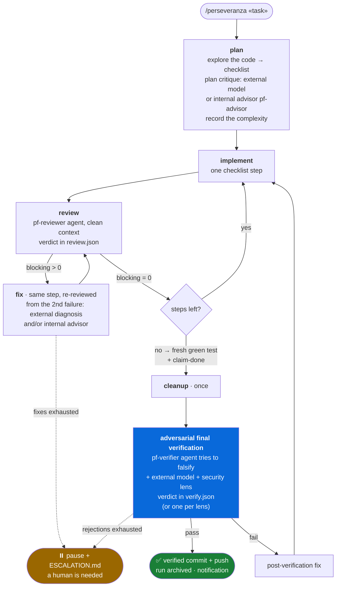

<div align="center">

# Perseveranza

**Give Claude Code a task and let it work until it is really done.**


*[Italiano](README.md)*

</div>

Perseveranza is a [Claude Code](https://claude.com/claude-code) plugin that turns a request
into an **autonomous feedback loop**: Claude explores the code, writes a plan, implements
one step at a time, has every step reviewed by a clean-context agent, and may call itself
"done" only after an **adversarial final verification** that tries to take the work apart.
At the end you get a verified commit and push, an archive of the run and a desktop
notification. When a human is needed, the loop stops and leaves a written hand-off.

Zero dependencies: it runs on Node.js, the same runtime as Claude Code. Dormant until you
arm it: in normal chats it does not exist.

## Installation

Requirements: **Claude Code 2.1.287 or later, in the CLI** (`claude`, `claude -p` too) and
Node.js ≥ 20. Since 3.0 Perseveranza is a [mod](#the-mod): the Desktop app and the VS Code
extension do not drive the loop ([full requirements](#requirements)). Three ways, **never two
at once**: two copies of the mod would drive the same loop.

1. **From the marketplace** (recommended). Inside Claude Code, one command at a time:

   ```
   /plugin marketplace add https://github.com/ilmondovero/perseveranza
   ```

   ```
   /plugin install perseveranza@perseveranza
   ```

   Update: `claude plugin update perseveranza@perseveranza`. Uninstall: from the `/plugin`
   panel.
2. **From a folder, for one session** (development and trials): `claude --plugin-dir <checkout>`.
   Claude Code writes `.claude-plugin/types/` into the folder and, when there is none, a
   `tsconfig.json` (both in `.gitignore` in the repository).
3. **Manual install**: `node install.mjs` copies the plugin into `~/.claude/perseveranza/` and
   has it loaded through `CLAUDE_CODE_PLUGIN_DIRS` in the `env` of `~/.claude/settings.json`, the
   documented way for a plugin that does not come from a marketplace. It writes no settings hook
   and removes those a 1.x or 2.x manual install left: only a hook that runs exactly one of
   their scripts, and only while that script is still theirs (gone, or identical to a release).
   A script of yours with a similar name stays; a hook that runs one of their scripts you edited
   stays too, and is listed.
   - **What it deletes, and nothing else.** (a) The files its marker,
     `~/.claude/perseveranza/.perseveranza-install.json`, lists (each with its size and sha256)
     while they are still as it wrote them, and the files Claude Code generates in a plugin
     folder it recognizes as its own. (b) Files a 1.x or 2.x install left that are **byte for
     byte** those of a past release: the hashes are in `src/shell/legacy-hashes.mjs`, computed
     from the git history and checked by the tests. (c) The leftovers of one of its own runs
     that was cut short, recognized by the file it writes into them first
     (`.perseveranza-staging.json`, with the pid, the time and a random value that are also in
     the folder's name), and only when that process is gone. **Everything else is only
     reported**: a file of yours with the name of an old one, an old copy you edited, a folder
     named like a leftover stay where they are, listed under "Left alone ... remove it
     yourself". When `~/.claude/hooks`, `agents` or `commands` is a link or a junction (to a
     dotfiles repository, say), it deletes nothing in it and says so.
   - **The folder.** It replaces or removes only a folder with its complete marker, or one
     without a marker (2.x, or a deleted marker) whose files are all exact copies of a release.
     It refuses, deleting nothing and saying what to do, a git checkout, a link or a junction,
     the checkout it runs from, a marker that is unreadable or another plugin's, and a folder
     with files it did not write or that changed since. `--uninstall` removes only the marker's
     files that are still intact and keeps yours (and the marker goes: a new install refuses
     that folder until you move your files). When the install is already there, identical file
     for file, it copies nothing and says so.
   - **Interruptions and concurrency.** The new copy is prepared aside and verified against the
     marker read back from the disk, then takes the old one's place with two renames.
     `settings.json` is written only after that. If an install is cut short, the next one puts
     the newest complete old copy back, or cleans its own leftovers. Two `install.mjs` runs on
     the same folder never overlap: the second waits for the lock
     `~/.claude/.perseveranza-install.lock` (up to 10 s), then stops and says what to do. A lock
     whose process is gone is taken over at once.
   - **`settings.json`.** It edits the file as text: it writes or removes its entry and removes
     the old hooks; **every other byte stays as it was** (numbers as you wrote them, inline
     arrays, spacing, escapes, keys written twice). The result must give exactly the settings
     expected, else it refuses and touches nothing (this happens only when a key it must change
     is written twice). Installing and then uninstalling gives back the same file byte for
     byte, with three exceptions: the entry it adds is written like the members beside it; the
     value of `CLAUDE_CODE_PLUGIN_DIRS`, when it changes, is written as standard JSON (an
     unneeded escape becomes the character); an empty file becomes `{}`, and an empty
     `"env": {}` that was already there goes. The entry is compared by real path: the same
     folder written another way (an 8.3 name, a junction, `subst`) is not added twice, and
     `--uninstall` removes every spelling. The first time it changes a file that already existed
     it keeps a copy, `settings.json.bak-perseveranza-3.0`, even when the
     `settings.json.bak-perseveranza` that 2.x left is there (it does not touch that one). It
     never overwrites the copy and never writes through anything already at that name (not even
     a dangling link). When the install created the file and it holds only its entry,
     `--uninstall` deletes it. It keeps the permissions, a leading BOM and a symbolic link (it
     writes to the file the link points to). It refuses, changing nothing, a file that is not
     valid JSON. Run again, it changes nothing.

   `--claude-dir <folder>` picks another configuration folder (otherwise `CLAUDE_CONFIG_DIR`,
   then `~/.claude`). Uninstall: `node install.mjs --uninstall` (`hud off` first if on).

To check: in a new session `/pf status` answers at once, without a model turn. If `/pf` does
not exist the mod is not loaded: see [troubleshooting](#troubleshooting).

## Usage

In the project you want to work on:

```
/perseveranza add pagination to the /orders endpoint, with tests --lang en
```

From here Claude arms the loop, writes the plan to `.perseveranza/plan.md` and the loop runs by
itself: at the end of every response the mod injects the next phase's instruction, with a
progress line on top:

```
[perseveranza v3.0.1 · ▸impl ▰▰▱▱▱ 2/5 · it7/23 · 84k tok] Task: add pagination…
```

When it is done you get the notification "Project finished and verified · commit+push confirmed".
Meanwhile `/pf status` tells you where it stands, even while Claude works; `/pf help` lists the
other verbs ([the `/pf` command](#using-the-mod)).

## Why it exists

An agent working alone tends to **declare itself done too early**: the common case works,
the edge cases do not, the tests "pass" in its head. A former Meta principal who put a
validator in front of his agent measured that **68% of the changes** contained bugs to fix
before the PR
([Kun Chen, `no-mistakes`](https://blog.bytebytego.com/p/an-ex-meta-l8s-agentic-engineering)).

Perseveranza is built on three principles:

1. **Closed loop, not a metronome.** Phases do not rotate blindly: a failed review sends
   back to the fix of the same step, a passed one advances the checklist. The routing is a
   table in the code, not a habit of the model.
2. **Cheap inner loop, strict exit gate.** The per-step review is light. The expensive
   check (adversarial verification, security lens, external model) runs once, when Claude
   declares the work done. Declaring done does not close the loop: **it triggers the check**.
3. **Proofs, not words.** The script runs the tests, Claude does not narrate them. Verdicts
   are JSON files written by the reviewers. The git closure is verified on facts. A missing
   outcome is never a promotion.

## How it works


```mermaid
flowchart TD
    START(["/perseveranza «task»"]) --> PLAN
    PLAN["<b>plan</b><br/>explore the code → checklist<br/>plan critique: external model<br/>or internal advisor pf-advisor<br/>record the complexity"] --> IMPL
    IMPL["<b>implement</b><br/>one checklist step"] --> REV
    REV["<b>review</b><br/>pf-reviewer agent, clean context<br/>verdict in review.json"] -- "blocking > 0" --> FIX
    FIX["<b>fix</b> · same step, re-reviewed<br/>from the 2nd failure: external diagnosis<br/>and/or internal advisor"] --> REV
    REV -- "blocking = 0" --> NEXT{"steps left?"}
    NEXT -- "yes" --> IMPL
    NEXT -- "no → fresh green test<br/>+ claim-done" --> CLEAN
    CLEAN["<b>cleanup</b> · once"] --> VERIFY
    VERIFY["<b>adversarial final verification</b><br/>pf-verifier agent tries to falsify<br/>+ external model + security lens<br/>verdict in verify.json<br/>(or one per lens)"] -- "pass" --> DONE
    VERIFY -- "fail" --> POSTFIX["post-verification fix"] --> IMPL
    FIX -. "fixes exhausted" .-> PAUSE
    VERIFY -. "rejections exhausted" .-> PAUSE
    DONE(["✅ verified commit + push<br/>run archived · notification"])
    PAUSE(["⏸️ pause + ESCALATION.md<br/>a human is needed"])

    style DONE fill:#1a7f37,color:#fff
    style PAUSE fill:#9a6700,color:#fff
    style VERIFY fill:#0969da,color:#fff
```

| phase | who | what it produces |
|---|---|---|
| **plan** | Claude, after exploring the code; critique by an external model or by `pf-advisor` | `plan.md` as a checklist, complexity recorded |
| **implement** | Claude (or `pf-executor` with opus when complexity is high) | one step, with its edge cases |
| **review** | `pf-reviewer`, clean context, model by complexity | `review.json` with `requestId`, `blocking` and findings |
| **fix** | Claude, on the same step; from the 2nd attempt with the opinion of `pf-advisor` | the fix, which goes back to review |
| **cleanup** | Claude, once | dead code and duplication removed, docs updated |
| **final verification** | `pf-verifier`, assuming the work is wrong, one per lens | `verify.json` (or one `verify-<lens>.json` per lens) with `requestId`, `pass` and findings |
| **closure** | the mod at a Stop, not Claude | commit, push, run archive, notification |

The reviewers' model follows the complexity Claude records: `haiku` / `sonnet` / `opus`
for the review, `sonnet` / `opus` / `opus` for the final verification. With `high` the
final verification splits into three lenses working side by side (see below).

## The guarantees

- **The script runs the test.** The `test` verb launches the suite and records the real
  exit code plus a fingerprint of the work tree. `claim-done` is accepted only with a green
  run for the current tree: in the same iteration, or from an earlier one when the code did
  not change since (a change confined to documentation files does not count).
- **The suite runs once per tree, not once per agent.** `test --if-needed` does not rerun a
  suite whose green is already recorded for the same tree, and every phase receives the
  current "test proof", so Claude and its subagents run targeted tests instead of repeating
  the whole suite out of caution. The verb also records which tests failed and flags a red
  that does not reproduce on the same tree (a flaky test, not a bug).
- **A consumed verdict is not lost.** `review.json` and `verify.json` are renamed to
  `review-<n>.json` / `verify-<n>.json` when the loop reads them: the fix phase rereads the
  findings there instead of asking the reviewer again.
- **A stop that changed nothing does not advance.** When the work tree is identical to the
  one at the previous stop and no test was recorded (typically a subagent still running when
  the turn ended), the loop asks once to finish the step instead of sending nothing to
  review.
- **Verdicts have a schema.** `review.json` and `verify.json` are validated; when the
  declared verdict and the findings disagree the stricter reading wins; a malformed or
  missing file counts as a rejection, in the review and at the final gate alike.
- **The git closure is verified on facts.** Clean work tree and HEAD not ahead of upstream,
  within the hook deadline. If it cannot be confirmed the loop stops in `git-finish` and
  tells you what is missing; `resume` retries. `.perseveranza/` never ends up in the commit.
- **Nothing is lost.** At the end of a run `.perseveranza/` (journal, plan, notes, external
  opinions) is archived in `~/.perseveranza/runs/` with a `summary.json`: `runs list`,
  `runs show`.
  If archival fails, files stay in `.perseveranza` and the loop is disarmed; `status` explains
  recovery. Fix the destination and run `disarm` to retry archival. Until recovery,
  `arm` refuses to overwrite the retained run.
- **Caps and switches.** Adaptive iterations from the plan or `--max`, real tokens with
  `--budget-tokens`, fixes per step with `--max-retries`. Kill switch from any session:
  the `.perseveranza/STOP` file or `PERSEVERANZA_KILL=1`.
- **One loop, one session.** The first session that fires claims the loop; the others never
  touch it, not even after a night of silence: the hand-over is explicit
  (`resume --takeover`). N `git worktree`s = N parallel loops.
- **An orphaned loop does not stay invisible.** The loop lives in the Stops of the owner
  session: when that session dies (terminal closed, Esc mid-turn, crash) the state says
  "phase review" forever. So the mod, at start, tells every new session opened in the
  folder that a loop of another session exists, how long it has been silent and in which
  phase it was, and asks the user whether to resume it (`resume --takeover`) or stop it
  (`disarm`). `status`, the HUD and the `disarm` recap show the age of the last fire (`STALE`
  past thirty minutes, `PERSEVERANZA_STALE_MS`); the journal records the hole (`gap`).
- **The loop has a heartbeat inside the turn too.** The mod sees every tool call (the
  delegations to Agent, the working tools) and every subagent return, and writes
  `.perseveranza/activity.json`: the silence is
  measured from the last sign of life, not the last Stop, and a subagent delegated and never
  returned reads as such ("delegated to pf-reviewer at 11:10, not back yet") in `status`, the
  HUD and the notice at a session start.
- **A watchdog speaks when the loop goes silent.** Every Stop (and `arm`) spawns a detached
  process that sleeps until the threshold, re-sleeps as long as the loop shows life and, when
  the silence is real, sends the desktop notification and writes `watchdog` to the journal
  and to `summary.json`. No cron, no session to keep open; `PERSEVERANZA_NO_WATCHDOG=1` disables it.
- **With `PERSEVERANZA_RESTORE=1` the watchdog unblocks.** Claude Code has no interface to
  interrupt a running tool: the only interrupt is Esc. The watchdog does what Esc would: it
  terminates the Claude Code process that drove the loop (recorded at the Stop) and reopens
  the same session, same id, in a new console with a restore prompt. A hung turn costs the
  threshold, not a night. Three signs of life (Stop, tool activity, transcript writes) and
  the `test` verb's heartbeat during the suite make thirty silent minutes a dead turn, not a
  slow one. Two stages: alert at thirty minutes, kill and restore at sixty
  (`PERSEVERANZA_RESTORE_AFTER_MS`), because a session waiting on a question to the user writes
  nothing either and the alert is its chance. At most three restores per run; no relaunch
  without a recorded process. Before terminating or launching anything it creates
  `.perseveranza/restore-launched.json` exclusively (whoever creates it wins the restore: two
  watchdogs that both believe they own the loop launch once) and writes the interruption into
  `state.json`: if either write fails, or the state stands only in its pending copy (a write cut
  short), it alerts and nothing more. No second restore starts until the reopened session
  reaches a Stop. That file never blocks for ever: dated in the future (a clock set back) it is
  discarded; one left by a watchdog that died before its launch is abandoned after twice the
  restore threshold (at least ten minutes) and the attempt counts among the three; a folder in
  its place is moved aside. One from a successful launch waits for the reopened session's Stop,
  as that session may be waiting on a prompt.
  Off by default; verified by hand on Windows before it was
  written. `PERSEVERANZA_CLAUDE_BIN` names the `claude` binary when it is not on `PATH`;
  `PERSEVERANZA_ACTIVITY_HEARTBEAT_MS` tunes the `test` verb's heartbeat.
- **After a restore, reconcile first, read-only.** The reopened session inspects plan,
  notes, diff and processes and writes `.perseveranza/reconcile.json` (`complete`, `partial`,
  `uncertain`, with the commands still running). Until it does, the mod refuses edits,
  delegations and any command that is not read-only: prompt instructions do not make an
  agent read-only, a refused tool does. `partial` continues the step without redoing what
  exists, `complete` goes to review, `uncertain` or a live command pauses for a human. Retry
  counters are not reset: the interruption counts, it buys no budget. The replacement
  watchdog gives the restored session one full startup interval before judging it again.
- **Every verdict answers one exact request.** Every prompt that asks for a verdict issues
  a new request with its `requestId`, which the agent copies into the file. A
  `review.json` or `verify.json` with another id answers an earlier request (a subagent of
  a killed turn or of an earlier round, a file left across a takeover), even when written
  later: it is set aside as `review-stale-<n>.json` and the phase asks for the verdict,
  once. A verdict without an id (an older prompt pack) counts if written after the
  request; one with the right id counts even when the file clock lags.
- **The final verification can look through several lenses.** With `--verifiers correctness,security,tests`
  (and by default at complexity `high`) Claude delegates in one message, in the foreground,
  one verifier per lens: `correctness` (logic, edge cases, hostile inputs, regressions the
  fixes introduced), `security` (secrets, untrusted input, injection, path traversal),
  `tests` (targeted tests, uncovered cases, comments and documentation that tell the truth).
  Each writes `verify-<lens>.json` with the same `requestId`. The round passes only when every
  lens wrote and none has a `critical` finding; a `pass: false` without a critical is a pass
  with warnings, noted in the journal, unless a finding is `high`/`major` (that blocks). A missing lens is asked for alone, the others stay
  valid; the second time it is a rejection. The findings of every lens end up, each with its
  lens, in one `verify-<n>.json`. A `verify.json` for the round (a custom prompt pack that does not know the lenses)
  covers every lens that has no file of its own, and rejects the round if it rejects
  (`lens-fallback` in the journal). With the `general` lens alone (the
  default up to complexity `medium`) everything stays as it was: one verifier, `verify.json`.
- **Every rejection makes the next round stronger.** The `verify-<n>.json` of the last three
  rejected rounds enter the prompt of the next verification: every verifier must check that
  those defects are fixed and that the fixes introduced no regression.
- **A second opinion even without external models.** The `pf-advisor` agent (clean context,
  read-only on the source, model `opus` by default) steps in where a second opinion really
  helps: before the plan is delivered, and when the same error comes back (from the 2nd fix
  after a rejected review, from the 2nd rejection of the final verification). With external
  models detected it is the fallback when none answers; without them it is the second
  opinion. It writes one free-text file, `.perseveranza/advisor-<slot>-<n>.md` (critique, three
  risks, what it would change, what it could not check): no JSON, no verdict. On a fix it
  gets every attempt that already failed on the same step (`review-<n>.json`,
  `verify-<n>.json`), must not propose again an approach that already failed, and says
  whether the problem is the step itself: then Claude rewrites the step in `plan.md` before
  retrying. It is consultative: it never routes the loop, and a missing, empty or failed
  opinion is not a finding and blocks nothing (Claude notes it in `notes.md`). The journal
  records every hint (`advisor-hint`: slot and reason `no-external`/`fallback`/`off`) so
  its use can be measured; `status` shows `Advisor: on (opus)` or `off`. `--advisor off`
  turns it off, `--advisor-model` or `PERSEVERANZA_ADVISOR_MODEL` pick the model.
- **A final pass closes only what it judged.** If at the pass the plan has open steps
  again, the last recorded suite run is not a green run on the judged code (red, missing,
  or run before a cleanup that touched the code), or the code changed after the
  verification was requested, nothing is committed and the loop goes back to implement: a
  new claim-done is needed. The code is everything git does not ignore, documentation
  aside: build and test output belongs in `.gitignore`, or the verifier's own runs change
  it. After four passes that do not cover the tree, with no rejection in between, the loop
  pauses for a human.
  Outside git there is no snapshot to compare.

## Commands

The options of `/perseveranza`:

| option | effect |
|---|---|
| `--max N` | iteration cap (otherwise adaptive: `8 + 3 × steps`, at most 60) |
| `--budget-tokens N` | token cap, measured from the session transcript and those of its subagents |
| `--max-retries N` | fixes granted per step before the pause (default 3) |
| `--commit` | atomic commit after every validated step |
| `--test "cmd"` | the suite (if you do not pass it, Claude finds it) |
| `--approve-plan` | pause after the plan: you approve with `/pf resume` (Claude cannot) |
| `--verifiers <lenses>` | final verification lenses among `general`, `correctness`, `security`, `tests` (default `auto`: the last three at complexity `high`, otherwise `general`) |
| `--external off` | no comparison with external models |
| `--advisor off` | no internal advisor (default `on`) |
| `--advisor-model <name>` | model of the internal advisor (default `PERSEVERANZA_ADVISOR_MODEL`, else `opus`) |
| `--check` | probe the detected providers now: start only with those that answer |
| `--no-git-finish` / `--no-push` | no commit+push at the end / local commit only |
| `--lang en` | instructions in English (default: Italian) |

The verbs Claude, and you, use to talk to the loop (`node "<root>/src/cli/perseveranza.mjs" <verb>`):

| verb | what it does |
|---|---|
| `status` · `history` · `explain` | readable summary · the run journal · transition table and next outcomes |
| `test [--if-needed] -- <cmd>` | runs the suite and records the proof; `--if-needed` skips it when a green is already recorded for this tree |
| `report` · `complexity` · `claim-done` | Claude's signals to the loop |
| `pause` · `resume [--takeover]` | suspend / resume (resume resets the retries; `--takeover` releases the owner session: the next Stop of whoever runs it takes the loop from the current phase) |
| `ask <provider> <slot> -- <prompt>` | opinion of an external model, saved as an artifact |
| `providers [list\|check\|enable]` | external providers; `check` probes liveness and disables the dead ones |
| `runs [list\|show <id>]` | the archive of runs |
| `prompts [keys\|show\|layers\|validate]` | the prompt pack and its layers |
| `config` · `hud on\|off` | local configuration · statusline |
| `disarm` · `arm --force` | stops the loop (archiving it) · overwrites an armed loop |

The same verbs have two more doors, which run the same CLI without a shell: the `/pf` command
for you and the `perseveranza` tool for Claude ([using the mod](#using-the-mod)).

## The mod

### What it is

Since 3.0 Perseveranza is a Claude Code **mod**: a plugin with a hooks module
(`hooks/register.js`, declared in `hooks/hooks.json` under `modules`) that runs inside Claude
Code instead of in one process per event. It is the loop's only driver: at every Stop it asks
the Node engine (the bridge `src/shell/mod-bridge.mjs`) for the next phase and injects it. It
sees what a settings hook did not: the subagents still at work (the Stop waits for them instead
of counting a missing verdict), the tokens of every model request, per agent, a judge that stops
without its verdict (sent back), the model of the `pf-*` subagents by complexity. In a project
with no armed loop it starts no process. It registers the `/pf` command and the `perseveranza`
tool.

### Requirements

- **Claude Code 2.1.287 or later** (`claude --version`).
- **The CLI**: `claude` or `claude -p`. Neither the Desktop app nor the VS Code extension: the
  mod reaches the engine with `$.process.run`, which Claude Code gives the CLI only. In those
  sessions the mod leaves no sign of life and `arm` refuses (with `--no-mod-check` it arms, but
  nothing drives the loop there).
- **Mods on**: not with `--bare`, `--safe-mode`, `"disableAllHooks": true` in the settings or an
  organization policy (`allowManagedModsOnly`, a managed `disableAllHooks`). The workspace must
  be trusted (the trust dialog accepted).
- **The remote rollout switch on**: Claude Code can turn mods off remotely and remembers the
  last state. If it is saved off, one `claude -p "ok"` with the network refreshes it.
- **`node` reachable for Claude Code** (on its `PATH`, or `PERSEVERANZA_NODE`).
- `claude -p --setting-sources project` reads no user settings, where both the installed plugins
  and the `env` of `install.mjs` live: there the mod loads only with `--plugin-dir`.

### Using the mod

- **`/perseveranza <task>`** starts a task: it is the markdown command, Claude arms the loop and
  writes the plan.
- **`/pf <verb>`** is the command for you. It answers at once, even while Claude works, without a
  model turn (in `claude -p "/pf status"` the exit code is the verb's). A verb that takes no
  words refuses extra ones (`/pf disarm the alarm` disarms nothing).

  | command | what it does |
  |---|---|
  | `/pf` · `/pf status` · `/pf history [--tail N] [--json]` · `/pf explain` | the state, the journal, the transitions |
  | `/pf runs [list\|show <id>]` | the archive of runs (`<id>` as `runs list` prints it) |
  | `/pf arm "<task>" [options]` | arms without Claude, with the CLI's options (Claude writes the plan at its first turn) |
  | `/pf disarm [--no-archive]` | stops the loop, archiving it |
  | `/pf pause` · `/pf resume [--takeover]` | suspends · resumes; `--takeover` takes another session's loop for this one |
  | `/pf report pass\|fail` · `/pf complexity low\|medium\|high` · `/pf claim-done` | the signals Claude usually sends |
  | `/pf test [--if-needed] -- <cmd>` · `/pf ask <provider> <slot> -- <prompt>` | the suite · an external model's opinion |
  | `/pf help` | the help |

- **The `perseveranza` tool** (`mcp__perseveranza__perseveranza`) is for Claude, and takes only
  the verbs that read or move the loop's state: `status`, `history`, `explain`, `report`,
  `complexity`, `claim-done`, `pause`, with the arguments as the instruction writes
  them (`{"verb": "report", "args": "pass"}`). The suite and the external models Claude runs with
  Bash: `node "<root>/src/cli/perseveranza.mjs" test --if-needed -- <cmd>`. Resuming a paused
  loop is yours (`/pf resume`): since 3.0.1 the tool has no `resume`.
- **`arm` checks the mod.** Inside a Claude Code session it looks for the sign of life the mod
  writes (`~/.perseveranza/mod-alive/<session>.json`, at start and at the session's tool calls):
  if it is there, the instructions name the tool; if not, it refuses and says why. Outside a
  session (a terminal, a script) it arms with a warning and the instructions name the CLI;
  `--no-mod-check` arms without checking.

### Security

A mod's tool runs **without asking your permission**. So the `perseveranza` tool runs nothing
your Bash permissions would govern. Through the tool Claude **cannot**:

- run the suite or any other command (`test`) or an external agent's CLI (`ask`): they stay shell
  commands, which Claude runs with Bash and your Bash permissions govern;
- arm, disarm or take another session's loop (`arm`, `disarm`, `resume --takeover`): they are
  yours, with `/pf`;
- resume a paused loop (`resume`): a pause is where the loop waits for you, to approve the plan
  (`--approve-plan`) or after an escalation (the retries spent), and `resume` lifts the pause and
  resets the retry counters. If Claude could do it on its own it would approve its own plan and
  go past the limit that asks for a human: you do it, with `/pf resume`. `pause` Claude may use
  (stopping to ask you something hands control to you, it bypasses nothing);
- change another session's loop: every verb that changes something is refused (also when the
  owner cannot be read);
- start a process with no armed loop (except `status`) or with arguments outside the schema:
  everything is checked first, and the CLI starts with an argument list, never a shell.

Through the tool Claude **can** send its loop's own signals, and they are needed: `report
pass|fail` records the outcome of a review or of the final verification when the subagent did not
write its file (a valid verdict file decides anyway; in a final verification by lenses a declared
`pass` covers no lens), and `claim-done` declares the work done, but it is accepted only with the
plan fully ticked and (when the loop knows a suite) a green run of it recorded for the current
tree, and it leads to the
cleanup and the adversarial final verification, not to the closure. Neither lifts a pause, but
when the machine accepts them they act on the loop: a review `pass` resets the retries and moves
the step on, an accepted `claim-done` resets the retries and starts the cleanup or the final
verification. So, while the loop is paused, `report` and `claim-done` are refused, from the tool
and from the shell alike, and record nothing: an outcome sent while the loop waits for a person
would be used by the first Stop after `/pf resume`. Races included: an outcome that arrives while
the Stop that pauses is running does not enter the paused state (the journal marks it
`outcome-dropped-paused`), and if a pause lands right after the verb's write the outcome is taken
back and the verb says so; the verb's exit always matches what is on disk. Once resumed they are
recorded as usual.

The CLI refuses the same verbs in turn when the call comes from the tool: two walls, not one.
Claude cannot run `/pf` (Claude Code refuses a mod's command from the `Skill` tool), and
`/pf arm`, `disarm`, `test`, `ask` and `resume --takeover` run only for what you type (or
`claude -p`, or Remote Control), not for the command another plugin runs.

### Troubleshooting

**`arm` refuses: "the perseveranza mod is not running in this Claude Code session".** No sign of
life of the mod for the session you armed from. Without the mod nothing would drive the loop,
so `arm` does not arm. Causes and remedies:

| cause | remedy |
|---|---|
| Claude Code older than 2.1.287 | `claude update`, then a new session |
| plugin not loaded (not installed, disabled) | `/plugin`; for a checkout `--plugin-dir`; with `install.mjs` check `CLAUDE_CODE_PLUGIN_DIRS` in `~/.claude/settings.json` |
| mods off: `--bare`, `--safe-mode`, `disableAllHooks`, a policy | start without those flags; a policy is the administrator's call |
| workspace not trusted yet | accept the trust dialog |
| remote rollout switch saved off | `claude -p "ok"` with the network, then a new session |
| the Desktop app or the VS Code extension | use the CLI (`claude`) |
| session idle for over 30 days (sign of life pruned) | any tool call writes it again, or reopen the session |
| `PERSEVERANZA_HOME` different for Claude Code and its Bash (in a shell profile only) | set it where Claude Code starts, or unset it |

To arm anyway (a trial, or a loop another session with the mod will drive): `--no-mod-check`.
To see what Claude Code loads: the debug log (`claude --debug-file <file>`), and
`claude plugin validate .` on a checkout.

**`.perseveranza/mod-fault.json`.** The mod writes it when a Stop could not reach the bridge
(usually `node` does not start): that Stop let Claude stop. `status` shows it, the watchdog's
notification names it, the next Stop that reaches the bridge journals it and removes it, and
`arm` removes one left by an old run. Check that `node` runs for Claude Code (or set
`PERSEVERANZA_NODE`), then a new turn (`/pf resume` if the loop is paused).

**"rollout switch saved off".** `claude plugin test` and the debug log say it when mods are off
by the saved remote switch: `claude -p "ok"` with the network refreshes it. If it comes back,
mods are off remotely for your installation and the loop is not driven (no settings hook stands
in, by design).

**`/pf` does not exist.** The mod is not loaded in that session: the same causes as the table.

### Known limits

- The CLI only: neither the Desktop app nor the VS Code extension.
- The recovery of a failed Stop works once per user turn: if the bridge breaks mid-loop Claude
  stops (not silently: journal or `mod-fault.json`, `status`, the watchdog) until someone resumes
  or the watchdog's restore reopens the session.
- With mods off (remote switch, policy, flags) the loop is not driven: one driver, by design.
  `status` lets you see it (the last fire ages) and the watchdog warns about the silence.
- The sign of life says the mod started in the session, not that it still runs.
- The mod loses with its process the facts not written yet: up to 15 s of tokens and 30 s of
  heartbeat. A reload also resets the judges' `askedTimes` counts: at most 2 more send-backs to
  a judge.
- The state is written without a lock: a window is left between a writer's last check and its
  rename. It is usually an instant; on a machine with a saturated CPU it lasts as long as the
  writer is held between the two calls (1.6 s measured). Whoever saves in that window is
  overwritten: a verb loses its change, a Stop its counts. The tokens of an overwritten Stop are
  counted again at the next Stop, unless a third Stop already removed the inbox files it
  counted: those tokens are lost. The error is always an undercount, a token is never counted
  twice. It takes several overlapping writers, and Claude Code does not overlap the Stops of a
  session.
- A Stop waits for a `pf-*` subagent still at work up to 30 s (`PERSEVERANZA_SUBAGENT_WAIT_MS`),
  three times at most per verdict request.
- The watchdog's restore prompt names the CLI: the reopened session may not have the mod.

## Configuration

`~/.perseveranza/config.json`, never in the repo:

```json
{
  "lang": "en",
  "ollama": { "apiKey": "<key>", "model": "glm-5.3#low,deepseek-v4-flash:0731#none" },
  "providers": { "disabled": ["codex"], "timeouts": { "ollama-cloud": 300000 } }
}
```

(`providers.lastCheck` is written by `providers check` and `arm --check`: it is what `arm`
reports as reachable, as opposed to "installed".)

- **Language.** The injected instructions are in Italian by default (`packs/it.json`).
  Precedence: `--lang` > `PERSEVERANZA_LANG` > `lang` in the config > Italian. The shell
  locale does not count. For English: `--lang en` once, or `"lang": "en"` in the config.
- **External models.** Auto-detected at arm: `codex`, `agy`, `grok`, `cursor`, `claude`
  itself as a clean-context counter-check, `ollama-cloud` via API. The prompt never goes
  through a shell; auto-approving CLIs use a fresh empty temporary directory per invocation,
  with cleanup at the end. A policy refusal or a
  timeout is not a finding: the binding verdict stays the verifier's. A timeout or a network
  error is retried once (`PERSEVERANZA_ASK_RETRIES`) and the message says how to raise the limit
  (`PERSEVERANZA_ASK_TIMEOUT_MS` or `providers.timeouts.<id>`); "detected" at arm means installed,
  not reachable: `arm` reports the outcome of the last `providers check` and with `--check`
  probes the providers right away, dropping for the run those that do not answer.
- **Per-model reasoning** (`ollama-cloud` only). Every entry of `model` can carry its own
  reasoning effort after a `#`: `glm-5.3#low`, `deepseek-v4-flash:0731#none`. Values:
  `high`, `medium`, `low`, `max`, `true`, `false` (aliases for `false`: `none`, `off`);
  without `#` the model default applies. The separator is `#` because the colon already
  separates the ollama tag. An unrecognized value is refused locally, without spending a call.
- **Prompt pack.** Every phase instruction is an overridable template. Layers, strongest
  first: `PERSEVERANZA_PROMPT_PACK=<file>` → `.perseveranza/prompts.json` → `packs/<lang>.json` →
  defaults. A pack changes what is said, never the routing.
- **Notifications.** BurntToast on Windows, `osascript` on macOS, `notify-send` on Linux;
  silent when absent. **HUD.** `hud on` adds the progress line to the statusline, composing
  with the existing one. `hud off` restores the original configuration only while the
  current statusline still belongs to Perseveranza.

## Environment variables

All optional, all prefixed `PERSEVERANZA_`. Switches are on with `1` (also `true`, `yes`,
`on`); durations are in milliseconds.

| variable | default | effect |
|---|---|---|
| `PERSEVERANZA_HOME` | `~/.perseveranza` | where the config, the runs archive and the update cache live |
| `PERSEVERANZA_LANG` | config, then `it` | language of the injected instructions (`--lang` wins) |
| `PERSEVERANZA_KILL` | off | at the first Stop the loop disarms itself (like the file `.perseveranza/STOP`) |
| `PERSEVERANZA_STALE_MS` | `1800000` (30 min) | silence after which the loop is `STALE` and the watchdog alerts |
| `PERSEVERANZA_NO_WATCHDOG` | off | no watchdog |
| `PERSEVERANZA_RESTORE` | off | the watchdog kills and reopens the hung session |
| `PERSEVERANZA_RESTORE_AFTER_MS` | 2 × the `STALE` threshold | silence after which the restore fires |
| `PERSEVERANZA_CLAUDE_BIN` | `claude` | the binary the restore relaunches |
| `PERSEVERANZA_NO_NOTIFY` | off | no desktop notifications (tests, headless, CI) |
| `PERSEVERANZA_ADVISOR_MODEL` | `opus` | model of `pf-advisor` (`--advisor-model` wins) |
| `PERSEVERANZA_ASK_TIMEOUT_MS` | `180000` | timeout of an external opinion (`providers.timeouts.<id>` wins) |
| `PERSEVERANZA_ASK_RETRIES` | `1` | retries after a timeout or a network error (at most 5) |
| `PERSEVERANZA_PROMPT_PACK` | none | a prompt pack JSON file, the strongest layer |
| `PERSEVERANZA_TEST_TIMEOUT_MS` | `1800000` (30 min) | timeout of the suite run by the `test` verb |
| `PERSEVERANZA_ACTIVITY_HEARTBEAT_MS` | `60000` | heartbeat of the `test` verb while the suite runs |
| `PERSEVERANZA_HOOK_TIMEOUT_MS` | `120000` | the deadline of the logic of one Stop; with the mod no more than `120000` (the mod waits for the bridge 125 s at most) |
| `PERSEVERANZA_SUBAGENT_WAIT_MS` | `30000` | how long a Stop waits for a `pf-*` subagent still at work (its verdict, or its return) before answering; `0` does not wait |
| `PERSEVERANZA_NODE` | `node` on the `PATH` | the `node` (an absolute path) the mod starts the bridge and the CLI with, when the one on Claude Code's `PATH` does not do |
| `PERSEVERANZA_STATUSLINE_BASE_TIMEOUT_MS` | `5000` | time granted to the existing statusline the HUD composes with |
| `PERSEVERANZA_NO_UPDATE_CHECK` | off | no check for new versions (any value) |

Caps and timeouts in detail: [docs/loop-budget.md](docs/loop-budget.md).

## State and archive

In a project the loop lives in `.perseveranza/`, and the mod sleeps (no process) until
`.perseveranza/state.json` exists:

| file | what it holds |
|---|---|
| `state.json` | phase, counters, signals, options; never by hand, only the verbs change it |
| `plan.md` · `notes.md` | the step checklist · decisions and traps, step by step |
| `journal.jsonl` | every transition (`history` renders it) |
| `review.json` · `verify.json` · `verify-<lens>.json` | the verdicts, kept as `review-<n>.json` / `verify-<n>.json` once the loop reads them |
| `advisor-*.md` · `external-*.md` | the opinions of the internal advisor and of external models |
| `activity.json` · `watchdog.json` · `reconcile.json` | the heartbeat of a turn · the watchdog · the reconciliation after a restore |
| `prompts.json` | a prompt pack for this run only (optional) |
| `ESCALATION.md` · `STOP` | the hand-off when a human is needed · the kill switch |
| `usage-inbox/` | the tokens measured by the mod, waiting for the next Stop |

The closing commit always leaves `.perseveranza/` out; if you commit yourself, put it in the
project's `.gitignore`. At the end of a run (disarm, kill and budget included) the folder is
moved to `~/.perseveranza/runs/<project>/<date>/loop/`, with a `summary.json` beside it:
`runs list` and `runs show <id>` read it. Since `~/.perseveranza/` holds the config too,
`arm` refuses to start in the home directory itself, where the two folders would coincide.

<details>
<summary><b>The transition table</b> (generated from the code with <code>npm run explain -- --markdown</code>; a test compares it with this copy)</summary>

<!-- transitions:start -->
| phase | outcome | next | action |
|---|---|---|---|
| plan | no-plan | plan | `plan-write`; asked once; a second miss still goes to implement |
| plan | approval | plan | `plan-approval`; pause; --approve-plan, once |
| plan | ready | implement | `implement-first`; adaptive budget set here when --max was not given |
| implement | idle | implement | `implement-idle`; asked once: the tree did not change since the previous stop and no test ran |
| implement | always | review | `review-delegate`; drops a stale review.json |
| review | pass | implement | `review-advance`; retries reset |
| review | fail | implement | `review-fix`; retries++; findings kept in review-<n>.json; external diagnosis from the 2nd fix |
| review | fail-limit | review | pause + escalation (fixes exhausted) |
| review | missing | review | `review-missing-outcome`; asked once |
| review | missing-twice | implement | `review-fix`; counts as a failed review |
| any | claim-open | unchanged | `claim-open-steps`; claim-done refused: unchecked steps |
| any | claim-no-test | unchanged | `claim-no-fresh-test`; claim-done refused: no green test for this iteration or this tree |
| any | claim-stale | unchanged | `claim-stale-test`; claim-done refused: code changed after the test |
| any | claim-unverifiable | unchanged | `claim-unverifiable-tree`; claim-done refused: the work tree could not be snapshotted within the hook deadline |
| any | claim-first | cleanup | `cleanup`; once per run |
| any | claim-again | final-verify | `final-verify`; drops a stale verify.json |
| cleanup | always | final-verify | `final-verify` |
| final-verify | pass | git-finish | commit+push within the deadline, archive, disarm, notify |
| final-verify | pass-open | implement | `verify-pass-open`; pass not applied, nothing committed: plan.md has unchecked steps |
| final-verify | pass-stale | implement | `verify-pass-stale`; pass not applied, nothing committed: no green suite run on the judged code, or the code changed since the request |
| final-verify | pass-stale-limit | implement | pause + escalation: passes kept not covering the current tree, with no rejection in between |
| final-verify | fail | implement | `verify-postfix`; finalFails++; findings kept in verify-<n>.json |
| final-verify | fail-limit | final-verify | pause + escalation |
| final-verify | missing | final-verify | `verify-missing-outcome`; asked once |
| final-verify | missing-twice | implement | `verify-postfix`; counts as a failed verification |
| any | subagent-running | unchanged | `subagent-running`; implement, review or final-verify with a pf-* subagent still running (seen by the mod): wait for it, at most 3 stops in a row; no iteration spent |
| git-finish | retry | git-finish | after resume: retry the closure |
| any | budget | disarm | iterations or tokens exhausted: archive, disarm, notify |
| any | kill | disarm | STOP file or PERSEVERANZA_KILL: before any other check |
| any | unknown-phase | plan | `phase-recovered`; tampered state: restart from the plan |
| any | reconcile-missing | unchanged | `reconcile-missing`; restored session: reconcile.json missing or invalid, asked once |
| any | reconcile-uncertain | unchanged | pause + escalation: a command still running, an uncertain disposition, or reconcile.json missing twice |
| any | reconcile-implement | implement | `reconcile-implement`; work partial: continue the current step from disk; counters untouched |
| any | reconcile-review | review | `review-delegate`; work complete: review it; counters untouched |
<!-- transitions:end -->

</details>

## Under the hood

The engine is a **pure core** (`src/core/`): a state machine that receives state and facts
and returns the new state plus a list of effects; the **shell** (`src/shell/`) reads the
Stop event, gathers the facts, executes the effects. The state lives in
`.perseveranza/state.json`, grouped by owner: the Stop writes phase and counters, the verbs
write the signals, `arm` writes options and limits. Every event goes to `journal.jsonl`.

```bash
npm test          # unit (core, no processes) + verbs + e2e (hook and git) + packaging
npm run test:mod  # the mod with Claude Code: validate --strict + claude plugin test + e2e with a real claude -p
                  # (without claude on the PATH every step says SKIPPED)
```

CI runs on Ubuntu, macOS and Windows with Node 20 and 22. To get into the code:
[docs/REVIEW-NOTES.md](docs/REVIEW-NOTES.md) (invariants and traps),
[CHANGELOG.md](CHANGELOG.md) (decisions and their why, Italian),
[docs/PIANO-V2.md](docs/PIANO-V2.md) (the design the 2.x comes from, Italian),
[docs/PIANO-MOD.md](docs/PIANO-MOD.md) (the design of the mod: verified facts, proofs, limits, Italian),
[bench/README.md](bench/README.md) (the bench that evolves the prompt pack, Italian).

## Migrating from 2.x to 3.0

3.0 is a **declared break**, in two parts. First: the loop is driven by the [mod](#the-mod),
no longer by settings hooks, so it needs Claude Code 2.1.287 or later, in the CLI. Second: the
loop folder, the CLI and the environment variables still carried the name of another tool and
are renamed; the old names are no longer read, not even as a fallback. The full old → new table
of the variables is in the [CHANGELOG](CHANGELOG.md) (Italian).

| what | in 3.0 |
|---|---|
| who drives the loop | the mod (`hooks/register.js`); no settings hook |
| loop folder in the project | `.perseveranza/` |
| run folder in the archive | `~/.perseveranza/runs/<project>/<date>/loop/` |
| CLI | `src/cli/perseveranza.mjs` |
| environment variables | prefix `PERSEVERANZA_` ([table](#environment-variables)) |
| starting a task | `/perseveranza <task>`, as before |
| the verbs, for you | `/pf <verb>` (new), or the CLI |
| the verbs, for Claude | the `perseveranza` tool for the loop's state; Bash for `test` and `ask` |
| manual install | `install.mjs` loads the plugin through `CLAUDE_CODE_PLUGIN_DIRS` |

**Removing the old hooks.** Two drivers of the same loop would be a fault, so the 2.x settings
hooks have to go:

- **from the marketplace**: `claude plugin update perseveranza@perseveranza` (or `/plugin`): the
  new `hooks/hooks.json` declares none;
- **1.x or 2.x manual install**: run `node install.mjs` again. It removes from `settings.json`
  the hooks that run `src/shell/stop.mjs`, `src/shell/session-start.mjs`,
  `src/shell/activity-hook.mjs` or `loop-drive`. Of the files the old installs copied (in
  `~/.claude/hooks/`, `~/.claude/commands/`, `~/.claude/agents/` and the 2.x folder) it deletes
  only those byte for byte equal to a past release; those with the same name but other content
  (edited by you, or yours) it lists and leaves: remove them yourself if they are leftovers.
  `node install.mjs --uninstall` does the same, and removes the mod;
- **hooks written by hand** to those scripts: remove them from `settings.json` (`/hooks` lists
  them).

The rest:

- **Loop folder.** Now `.perseveranza/`. A loop armed with 2.x stays in the old folder and
  3.0 does not drive it: `arm` and `status` point it out, with its task, and say how to close
  it. 3.0 neither moves nor deletes it: copy what you want to keep (`plan.md`, `notes.md`,
  `journal.jsonl`) and delete the old folder by hand. The closing commit never includes it.
- **CLI.** It is `src/cli/perseveranza.mjs`; the `/perseveranza` command already uses it,
  your own scripts and aliases need updating. `node install.mjs` copies the plugin afresh,
  without the old file.
- **Environment variables.** Prefix `PERSEVERANZA_` (table above); `PERSEVERANZA_HOME` and
  `PERSEVERANZA_LANG` are unchanged. An old variable still set has no effect: `arm` and
  `status` name it next to its new name.
- **Archive.** Still `~/.perseveranza/runs/`. New runs keep their files in `loop/`; the runs
  2.x archived stay as they are and `runs list` / `runs show` still read them.
- **Custom prompt packs.** Texts that mention the old folder need updating to
  `.perseveranza/`; the shipped packs already are.

From 1.x, in addition: the manual install lives in `~/.claude/perseveranza/` (rerun
`node install.mjs`, which removes the old files still identical to a release and lists the
others); removed pack keys `review-advance-no-outcome`,
`verify-failed-no-outcome`, new `claim-stale-test`, `claim-unverifiable-tree`.
