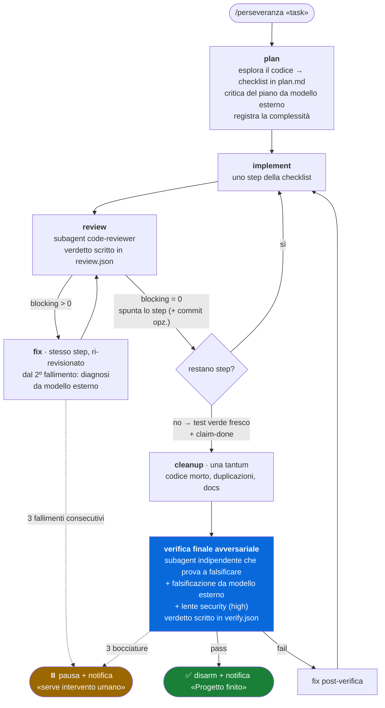

# Perseveranza


**Dai un task a Claude Code e lascialo lavorare finché non è davvero finito.**

Perseveranza è un ciclo autonomo a feedback: Claude esplora il codice, scrive un piano,
implementa uno step alla volta, fa revisionare ogni step da un subagent con contesto
pulito e può dichiararsi "finito" solo superando una verifica finale avversariale
indipendente. Una notifica desktop ti avvisa quando il progetto è completo o quando
serve il tuo intervento.

Il motore è uno **Stop hook dormiente**: non fa nulla finché non lo armi con
`/perseveranza`, quindi non interferisce con le chat normali. Tutta la logica gira su
Node.js — lo stesso runtime di Claude Code — senza altre dipendenze.

## Il loop in un colpo d'occhio



Tre principi guidano il disegno:

1. **Anello chiuso, non metronomo.** L'hook non ruota le fasi alla cieca: instrada in
   base agli esiti delle fasi. Una review bocciata rimanda al fix dello stesso step; una
   promossa fa avanzare la checklist.
2. **Ciclo interno economico, gate di uscita severo.** La review per step è leggera; il
   controllo costoso (verifica avversariale, security, modello esterno) scatta una sola
   volta, quando Claude dichiara di aver finito. Dichiararsi finiti non chiude il ciclo:
   **innesca il controllo**. Niente auto-certificazione.
3. **Prove, non parole.** I test li esegue lo script stesso (verbo `test`: è lui a
   lanciare il comando e registrare l'exit code reale), e il `claim-done` è accettato
   solo con un run verde fresco. I verdetti di review e verifica sono file JSON scritti
   dai revisori (`review.json`, `verify.json`) che l'hook parsa e consuma — non
   dichiarazioni di chi ha fatto il lavoro.

## Installazione (plugin, consigliata)

Dentro Claude Code, due comandi, **da eseguire uno alla volta** (incollati insieme nello
stesso invio la CLI li concatena in un unico URL malformato). Primo:

```
/plugin marketplace add https://github.com/ilmondovero/perseveranza
```

Secondo:

```
/plugin install perseveranza@perseveranza
```

Usare l'**URL HTTPS completo** come sopra: la forma breve `ilmondovero/perseveranza`
clona via SSH (`git@github.com:...`) e fallisce con `Host key verification failed` sulle
macchine senza chiavi SSH configurate — caso tipico su Windows, dove inoltre l'OpenSSH
di sistema (`C:\Windows\System32\OpenSSH`) può essere troppo vecchio per il key exchange
con GitHub (`unsupported KEX method sntrup761x25519...`).

Fatto: hook e comando sono registrati dal plugin system su qualunque OS, senza toccare
`settings.json`. Gli **aggiornamenti** si prendono dal pannello `/plugin` quando esce
una nuova versione.

### Requisiti

- [Claude Code](https://claude.com/claude-code) (Node.js arriva con lui)
- Consigliato: plugin **oh-my-claudecode** (fornisce i subagent `code-reviewer` ed
  `executor` citati nelle fasi; senza, Claude usa subagent generici)
- Opzionali, auto-rilevati: CLI di modelli esterni (`codex`, `gemini`, `antigravity`)
  per il secondo parere indipendente
- Notifiche desktop (opzionali, fallback silenzioso): BurntToast su Windows
  (`Install-Module BurntToast`, senza: beep), `osascript` su macOS (già presente),
  `notify-send` su Linux (pacchetto `libnotify`)

### Installazione manuale (alternativa)

```bash
git clone https://github.com/ilmondovero/perseveranza.git
cd perseveranza
node install.mjs
```

Copia gli script in `~/.claude/` e registra lo Stop hook in `~/.claude/settings.json`
(idempotente, con backup; sostituisce automaticamente installazioni precedenti).
Aggiornamento: `git pull` + di nuovo `node install.mjs`. Disinstallazione:
`node install.mjs --uninstall`.

**Non usare le due modalità insieme**: due Stop hook guiderebbero lo stesso loop facendo
avanzare le fasi due volte per risposta. Prima di passare al plugin, eseguire
`node install.mjs --uninstall`.

## Uso

```
/perseveranza implementa la feature X         # default: max 25 iterazioni
/perseveranza rifai il modulo Y --max 40
/perseveranza feature Z --commit              # commit atomico dopo ogni step validato
/perseveranza fix veloce --external off       # senza confronto con modelli esterni
```

Claude scrive il piano in `.omc-loop/plan.md` (checklist), registra la complessità e da
lì il ciclo procede da solo: a ogni fine risposta lo Stop hook inietta l'istruzione
della fase successiva. Per interromperlo in qualsiasi momento basta eliminare la
cartella `.omc-loop/` del progetto (equivale al verbo `disarm`), o chiedere a Claude di
eseguire il disarm.

## Le fasi, una per una

| fase | cosa succede | chi lavora |
|---|---|---|
| **plan** | esplorazione del codice rilevante, checklist in `plan.md`, critica del piano da un modello esterno, registrazione della complessità | sessione |
| **implement** | un solo step della checklist, niente anticipi | sessione (high: subagent `executor` opus) |
| **review** | revisione dello step appena fatto — riceve nel prompt step, file toccati e diff; scrive il verdetto in `review.json` (blocking + findings) | subagent `code-reviewer`, contesto pulito |
| **fix** | correzione dei problemi segnalati dalla review, stesso step; il fix viene poi ri-revisionato | sessione; dal 2º tentativo con diagnosi esterna |
| **cleanup** | una tantum dopo il `claim-done`: codice morto, duplicazioni, semplificazioni, docs — *prima* del gate, così la verifica valida il codice già ripulito | sessione |
| **verifica finale** | un verificatore indipendente parte dal piano e dal diff e **prova a falsificare** il lavoro: casi limite, input ostili, test e build eseguiti davvero | subagent indipendente + modello esterno |

## Il contratto: chi possiede cosa

Lo stato vive in `.omc-loop/state.json`. L'hook possiede fase e contatori; Claude
comunica solo attraverso questi verbi (mai editando lo stato a mano):

| verbo | quando | effetto |
|---|---|---|
| `arm "<task>" [flag]` | lo esegue il comando `/perseveranza` | arma il ciclo, rileva le CLI esterne |
| `complexity low\|medium\|high` | in fase plan | instrada i modelli delle fasi |
| `test -- <comando>` | dopo implement/fix e prima del claim | esegue la suite LUI STESSO e registra l'exit code reale |
| `report pass\|fail` | fallback se il subagent non ha scritto il verdetto su file | esito che instrada il loop |
| `claim-done` | a checklist completa | accettato solo con test verde fresco; innesca cleanup + verifica finale |
| `pause` / `resume` | quando serve input dell'utente | sospende / riprende il loop |
| `status` / `disarm` | quando vuoi | ispeziona / smonta tutto |

Ogni transizione finisce in `.omc-loop/history.log` — utile per ricostruire cosa è
successo durante una sessione notturna.

Oltre alla checklist `plan.md`, Claude mantiene `.omc-loop/notes.md`: 2-3 righe per step
completato (decisioni prese, trappole incontrate). È la memoria del loop che sopravvive
alla compattazione del contesto nelle sessioni lunghe: se il filo si perde, si riparte
da piano + note invece di reinventare scelte già fatte. La complessità registrata non è
scolpita: a ogni nuovo step Claude la rivaluta e può aggiornarla, adattando i modelli al
punto in cui si trova.

## Routing dei modelli per complessità

In fase plan Claude valuta il task e registra la complessità, che instrada i modelli
delle fasi (hint per i subagent):

| fase | low | medium | high |
|---|---|---|---|
| code-review (subagent) | haiku | sonnet | opus |
| verifica finale (subagent) | sonnet | opus | opus |
| implement | in sessione | in sessione | delega a executor `model=opus` |

## Confronto con modelli esterni

All'arm vengono auto-rilevate le CLI di modelli esterni presenti sulla macchina
(`codex`, `gemini`, `antigravity`). Se ce n'è almeno una, il ciclo aggiunge un secondo
parere indipendente nei tre punti a maggior leva, senza costare iterazioni:

- **piano**: critica del piano prima di iniziare a implementare;
- **fix ripetuti**: dal secondo fallimento consecutivo sullo stesso step, diagnosi
  indipendente del problema;
- **gate finale**: falsificazione del lavoro chiesta anche al modello esterno, oltre che
  al subagent avversariale.

Senza CLI esterne il ciclo è identico, solo senza questi confronti. Disattivabile con
`--external off`.

## Reti di sicurezza

- limite globale di iterazioni (default 25, `--max N` per cambiarlo)
- il `claim-done` è accettato solo con la prova di un test verde fresco (verbo `test`:
  l'exit code lo misura lo script, non è autodichiarato) quando una suite è nota
- i verdetti di review e verifica finale sono artefatti scritti dai subagent
  (`review.json` / `verify.json`), consumati dall'hook alla lettura: un verdetto vecchio
  non viene mai riusato
- 3 review fallite sullo stesso step → pausa + notifica «serve intervento umano»
- la chiusura richiede il pass della verifica finale avversariale (niente
  auto-certificazione), preceduta da un giro di cleanup e, per complessità high, estesa
  a una lente security
- stato corrotto → disarmo pulito con notifica
- a fine progetto la cartella `.omc-loop/` viene rimossa (aggiungerla comunque al
  `.gitignore` dei progetti su cui la si usa)

## Risoluzione problemi

- **`Host key verification failed` / errori SSH**: è stata usata la forma breve
  `owner/repo`. Ripetere con l'URL HTTPS completo. In alternativa, per continuare a
  usare la forma breve senza configurare SSH, dirottare GitHub su HTTPS a livello git:

  ```bash
  git config --global --add url."https://github.com/".insteadOf "git@github.com:"
  git config --global --add url."https://github.com/".insteadOf "ssh://git@github.com/"
  ```

  (nota: vale per TUTTI i repo `git@github.com:...` — chi usa chiavi SSH per i propri
  repo privati non la metta, o la rimuova poi con
  `git config --global --unset-all url.https://github.com/.insteadof`)
- **`EBUSY: resource busy or locked, rename ... marketplaces\...`**: residuo di un
  tentativo precedente fallito; rilanciare il comando (a cache pulita sparisce).
- **`URL rejected: Malformed input to a URL function`**: sono stati incollati più
  comandi nello stesso invio; eseguirli uno alla volta.

## Disinstallazione

- Plugin: disinstallare dal pannello `/plugin` (o disattivarlo con il toggle).
- Manuale: `node install.mjs --uninstall` dalla cartella del repo (rimuove file e voce
  hook da `settings.json`).
