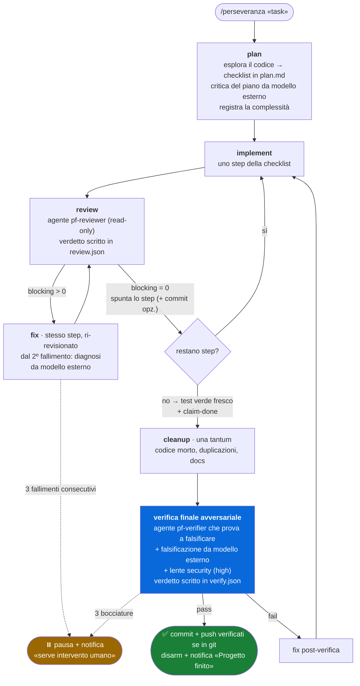

# Perseveranza


**Dai un task a Claude Code e lascialo lavorare finché non è davvero finito.**

Perseveranza è un ciclo autonomo a feedback: Claude esplora il codice, scrive un piano,
implementa uno step alla volta, fa revisionare ogni step da un subagent con contesto
pulito e può dichiararsi "finito" solo superando una verifica finale avversariale
indipendente. Una notifica desktop ti avvisa quando il progetto è completo o quando
serve il tuo intervento.

Il motore è uno **Stop hook dormiente**: non fa nulla finché non lo armi con
`/perseveranza`, quindi non interferisce con le chat normali. Tutta la logica gira su
Node.js — lo stesso runtime di Claude Code — senza altre dipendenze.

## Il loop in un colpo d'occhio



Tre principi guidano il disegno:

1. **Anello chiuso, non metronomo.** L'hook non ruota le fasi alla cieca: instrada in
   base agli esiti delle fasi. Una review bocciata rimanda al fix dello stesso step; una
   promossa fa avanzare la checklist.
2. **Ciclo interno economico, gate di uscita severo.** La review per step è leggera; il
   controllo costoso (verifica avversariale, security, modello esterno) scatta una sola
   volta, quando Claude dichiara di aver finito. Dichiararsi finiti non chiude il ciclo:
   **innesca il controllo**. Niente auto-certificazione.
3. **Prove, non parole.** I test li esegue lo script stesso (verbo `test`: è lui a
   lanciare il comando e registrare l'exit code reale), e il `claim-done` è accettato
   solo con un run verde fresco. I verdetti di review e verifica sono file JSON scritti
   dai revisori (`review.json`, `verify.json`) che l'hook parsa e consuma — non
   dichiarazioni di chi ha fatto il lavoro.

## Installazione (plugin, consigliata)

Dentro Claude Code, due comandi, **da eseguire uno alla volta** (incollati insieme nello
stesso invio la CLI li concatena in un unico URL malformato). Primo:

```
/plugin marketplace add https://github.com/ilmondovero/perseveranza
```

Secondo:

```
/plugin install perseveranza@perseveranza
```

Usare l'**URL HTTPS completo** come sopra: la forma breve `ilmondovero/perseveranza`
clona via SSH (`git@github.com:...`) e fallisce con `Host key verification failed` sulle
macchine senza chiavi SSH configurate — caso tipico su Windows, dove inoltre l'OpenSSH
di sistema (`C:\Windows\System32\OpenSSH`) può essere troppo vecchio per il key exchange
con GitHub (`unsupported KEX method sntrup761x25519...`).

Fatto: hook e comando sono registrati dal plugin system su qualunque OS, senza toccare
`settings.json`. Gli **aggiornamenti** si prendono dal pannello `/plugin` quando esce
una nuova versione.

### Requisiti

- [Claude Code](https://claude.com/claude-code) (Node.js arriva con lui)
- **Nessuna dipendenza da altri plugin**: gli agenti del ciclo (`pf-reviewer`,
  `pf-verifier`, `pf-executor`) sono inclusi. Se hai oh-my-claudecode i suoi agenti
  restano usabili, ma non servono
- Opzionali, auto-rilevati per il secondo parere indipendente: CLI di modelli esterni
  (`codex`, `gemini`, e `agy` solo su macOS/Linux — su Windows la sua print mode è
  inutilizzabile, bug noto gemini-cli#27466) e/o `ollama-cloud` via API (basta esportare
  chiave nel file `~/.perseveranza/config.json` o in `OLLAMA_API_KEY`; modelli con `model`/
  `OLLAMA_MODEL`, anche una lista separata da virgole per interrogarne più d'uno in un
  colpo; default `glm-5.2`)
- Notifiche desktop (opzionali, fallback silenzioso): BurntToast su Windows
  (`Install-Module BurntToast`, senza: beep), `osascript` su macOS (già presente),
  `notify-send` su Linux (pacchetto `libnotify`)

### Installazione manuale (alternativa)

```bash
git clone https://github.com/ilmondovero/perseveranza.git
cd perseveranza
node install.mjs
```

Copia gli script in `~/.claude/` e registra lo Stop hook in `~/.claude/settings.json`
(idempotente, con backup; sostituisce automaticamente installazioni precedenti).
Aggiornamento: `git pull` + di nuovo `node install.mjs`. Disinstallazione:
`node install.mjs --uninstall`.

**Non usare le due modalità insieme**: due Stop hook guiderebbero lo stesso loop facendo
avanzare le fasi due volte per risposta. Prima di passare al plugin, eseguire
`node install.mjs --uninstall`.

## Uso

```
/perseveranza implementa la feature X         # default: max 25 iterazioni
/perseveranza rifai il modulo Y --max 40
/perseveranza feature Z --commit              # commit atomico dopo ogni step validato
/perseveranza fix veloce --external off       # senza confronto con modelli esterni
/perseveranza feature W --no-git-finish       # niente commit+push automatico a fine progetto
```

Claude scrive il piano in `.omc-loop/plan.md` (checklist), registra la complessità e da
lì il ciclo procede da solo: a ogni fine risposta lo Stop hook inietta l'istruzione
della fase successiva. Per interromperlo in qualsiasi momento basta eliminare la
cartella `.omc-loop/` del progetto (equivale al verbo `disarm`), o chiedere a Claude di
eseguire il disarm.

## Le fasi, una per una

| fase | cosa succede | chi lavora |
|---|---|---|
| **plan** | esplorazione del codice rilevante, checklist in `plan.md`, critica del piano da un modello esterno, registrazione della complessità | sessione |
| **implement** | un solo step della checklist, niente anticipi | sessione (high: agente `pf-executor` opus) |
| **review** | revisione dello step appena fatto — riceve nel prompt step, file toccati e diff; scrive il verdetto in `review.json` (blocking + findings) | agente `pf-reviewer`, read-only, contesto pulito |
| **fix** | correzione dei problemi segnalati dalla review, stesso step; il fix viene poi ri-revisionato | sessione; dal 2º tentativo con diagnosi esterna |
| **cleanup** | una tantum dopo il `claim-done`: codice morto, duplicazioni, semplificazioni, docs — *prima* del gate, così la verifica valida il codice già ripulito | sessione |
| **verifica finale** | un verificatore indipendente parte dal piano e dal diff e **prova a falsificare** il lavoro: casi limite, input ostili, test e build eseguiti davvero; scrive `verify.json` | agente `pf-verifier`, read-only + modello esterno |
| **chiusura** | se la dir è un repo git: `git add -A` (escluso `.omc-loop/`), commit `perseveranza: <task>`, `git push`, poi **verifica che commit e push siano davvero avvenuti** (working tree pulito + HEAD non avanti all'upstream); se confermato disarm + notifica, altrimenti pausa per intervento e ritentativo dopo `resume`. Fuori da git, salta il git | l'hook stesso |

## Il contratto: chi possiede cosa

Lo stato vive in `.omc-loop/state.json`. L'hook possiede fase e contatori; Claude
comunica solo attraverso questi verbi (mai editando lo stato a mano):

| verbo | quando | effetto |
|---|---|---|
| `arm "<task>" [flag]` | lo esegue il comando `/perseveranza` | arma il ciclo, rileva le CLI esterne |
| `complexity low\|medium\|high` | in fase plan | instrada i modelli delle fasi |
| `test -- <comando>` | dopo implement/fix e prima del claim | esegue la suite LUI STESSO e registra l'exit code reale |
| `report pass\|fail` | fallback se il subagent non ha scritto il verdetto su file | esito che instrada il loop |
| `claim-done` | a checklist completa | accettato solo con piano interamente spuntato **e** test verde fresco; innesca cleanup + verifica finale |
| `pause` / `resume` | quando serve input dell'utente | sospende / riprende il loop |
| `status` / `disarm` | quando vuoi | ispeziona / smonta tutto |

Ogni transizione finisce in `.omc-loop/history.log` — utile per ricostruire cosa è
successo durante una sessione notturna.

Oltre alla checklist `plan.md`, Claude mantiene `.omc-loop/notes.md`: 2-3 righe per step
completato (decisioni prese, trappole incontrate). È la memoria del loop che sopravvive
alla compattazione del contesto nelle sessioni lunghe: se il filo si perde, si riparte
da piano + note invece di reinventare scelte già fatte. La complessità registrata non è
scolpita: a ogni nuovo step Claude la rivaluta e può aggiornarla, adattando i modelli al
punto in cui si trova.

## Routing dei modelli per complessità

In fase plan Claude valuta il task e registra la complessità, che instrada i modelli
delle fasi (hint per i subagent):

| fase | low | medium | high |
|---|---|---|---|
| code-review (subagent) | haiku | sonnet | opus |
| verifica finale (subagent) | sonnet | opus | opus |
| implement | in sessione | in sessione | delega a executor `model=opus` |

## Agenti inclusi

Il plugin spedisce i propri subagent, quindi il ciclo è autonomo (nessuna dipendenza da
altri plugin). Vivono in `agents/` e il loro contratto è scritto nel system prompt, non
solo nelle istruzioni iniettate:

| agente | ruolo | accesso |
|---|---|---|
| `pf-reviewer` | review per-step, scrive `review.json` | read-only sul sorgente |
| `pf-verifier` | verifica finale avversariale, esegue test/build, scrive `verify.json` | read-only sul sorgente |
| `pf-executor` | implementazione degli step ad alta complessità | scrittura completa |

Reviewer e verifier sono read-only *by design*: giudicano, non correggono (le correzioni
stanno nella fase di fix). Installato come plugin si invocano `perseveranza:pf-reviewer`
ecc.; via installazione manuale vivono in `~/.claude/agents/` col nome semplice. Se per
qualche motivo non sono disponibili, il loop ripiega su subagent generici.

## Confronto con modelli esterni

All'arm vengono auto-rilevati i modelli esterni disponibili sulla macchina. Il registro
dei provider è centralizzato in `scripts/providers.mjs` (unica fonte di verità: come si
rilevano, come si interrogano, quale modello/chiave usano), con due trasporti:

- **CLI locali**: `codex`, `gemini`, e `agy` (solo su macOS/Linux); rilevate via `where`/`which`;
- **API remota**: `ollama-cloud`, rilevata se è presente la chiave in `OLLAMA_API_KEY`.

Se c'è almeno un provider, il ciclo aggiunge un secondo parere indipendente nei tre punti
a maggior leva, senza costare iterazioni:

- **piano**: critica del piano prima di iniziare a implementare;
- **fix ripetuti**: dal secondo fallimento consecutivo sullo stesso step, diagnosi
  indipendente del problema;
- **gate finale**: falsificazione del lavoro chiesta anche al modello esterno, oltre che
  al subagent avversariale.

Ogni parere è eseguito dal verbo `omc-loop.mjs ask <provider> <slot>` (il prompt va su
stdin, così non finisce mai sulla command line: niente problemi di quoting/escape) che
**salva l'output** in `.omc-loop/external-<slot>-<provider>[-<modello>].md`
(`plan`/`fix`/`verify`): artefatti persistenti e auditabili, rimossi al disarm e mai
committati. Più pareri (provider o modelli diversi) coesistono senza sovrascriversi.

**ollama-cloud** (modelli grossi via API): la chiave **non sta mai nel repo**. La metti in
un **file di config fuori dal repo**, `~/.perseveranza/config.json` (consigliato: niente
`setx`, nessun riavvio di shell), oppure nella variabile d'ambiente `OLLAMA_API_KEY`:

```json
{ "ollama": { "apiKey": "<la-tua-chiave>", "model": "glm-5.2,kimi-k2.7-code" } }
```

I modelli si scelgono con `model` nel file (o `OLLAMA_MODEL`), che può essere una **lista
separata da virgole**: in tal caso una sola `ask ollama-cloud` interroga *tutti* i modelli
elencati, uno per artefatto. Default `glm-5.2`; l'host si cambia con `host`/`OLLAMA_HOST`
(default `https://ollama.com`). Precedenza: **variabile d'ambiente > file > default**.
Ispeziona la config effettiva (senza esporre la chiave) con `omc-loop.mjs config`. I
modelli cloud vengono ritirati nel tempo:
la lista reale è su <https://ollama.com/search?c=cloud> (o `GET /v1/models`).

Senza provider esterni il ciclo è identico, solo senza questi confronti. Disattivabile con
`--external off`.

## Stato di avanzamento (HUD)

Il progresso del loop è visibile in due modi.

**Header dell'istruzione** (sempre attivo, zero configurazione): ogni istruzione iniettata
inizia con un mini-HUD compatto — fase corrente, barra degli step di `plan.md`,
iterazione e contatori di retry/bocciature:

```
[perseveranza · ▸review · ▰▰▰▱▱ 3/5 · it7/25 · ↻1/3] Task: implementa X.
```

**Statusline live** (opt-in): una barra persistente che si aggiorna a ogni render,
**componendosi** con la statusline che hai già (es. OMC HUD) invece di sostituirla:

```
⟳ PRS ▸review ▰▰▰▱▱ 3/5 · it7/25 │ ‹la tua statusline…›
```

Si attiva/disattiva con (dal prompt, col prefisso `!`, o eseguito da Claude):

```
node <perseveranza>/scripts/omc-loop.mjs hud on      # cattura la statusline attuale come base e attiva la HUD
node <perseveranza>/scripts/omc-loop.mjs hud off     # ripristina la statusline precedente
node <perseveranza>/scripts/omc-loop.mjs hud status  # mostra stato e base salvata
```

`hud on` salva la statusline esistente come *base* in `~/.perseveranza/config.json`, installa
un wrapper stabile in `~/.perseveranza/statusline-hud.mjs` (così il path in `settings.json`
non cambia quando il plugin si aggiorna: il wrapper risolve sempre la versione più recente),
ripunta `statusLine` (con backup) e richiama la base con lo stesso input: quando un loop è
armato vede il segmento `⟳ PRS …`, altrimenti solo la base. Fuori da un progetto armato la
HUD è invisibile. Reversibile con `hud off`.

## Notifica aggiornamenti

Come fa OMC, perseveranza segnala quando esiste una versione più recente. Un controllo
giornaliero (in cache in `~/.perseveranza/update-check.json`, eseguito in un processo
distaccato così non rallenta nulla) confronta la versione installata con l'ultima su GitHub.
Se c'è un aggiornamento, lo vedi: all'`arm` (`⬆ Nuova versione vX … aggiorna da /plugin`),
nell'header di ogni istruzione (`· ⬆ vX (/plugin)`) e nella statusline (`⬆vX`). Per
aggiornare basta il pannello `/plugin`.

## Reti di sicurezza

- limite globale di iterazioni (default 25, `--max N` per cambiarlo)
- il `claim-done` è accettato solo se il piano è interamente spuntato (l'hook conta i box
  `- [ ]` residui in `plan.md`: se ne restano, il claim è rifiutato e si torna a chiuderli)
  e con la prova di un test verde fresco (verbo `test`: l'exit code lo misura lo script,
  non è autodichiarato) quando una suite è nota
- il verbo `test` ha un timeout (default 30 min; un timeout viene registrato come exit
  124 = rosso). Suite più lente: alza il limite con `OMC_TEST_TIMEOUT_MS` (millisecondi)
- i verdetti di review e verifica finale sono artefatti scritti dai subagent
  (`review.json` / `verify.json`), consumati dall'hook alla lettura: un verdetto vecchio
  non viene mai riusato
- 3 review fallite sullo stesso step → pausa + notifica «serve intervento umano»
- la chiusura richiede il pass della verifica finale avversariale (niente
  auto-certificazione), preceduta da un giro di cleanup e, per complessità high, estesa
  a una lente security
- stato corrotto → disarmo pulito con notifica
- l'hook non blocca quando Claude Code deve potersi fermare per davvero (stop da limite di
  contesto — altrimenti non potrebbe compattare; interruzione dell'utente), evitando
  deadlock. Ogni invocazione registra in `history.log` una riga `FIRE sha=…` (valore di
  `stop_hook_active`) utile per diagnosticare
- a fine progetto, se in un repo git, commit+push automatico del lavoro (escludendo
  `.omc-loop/`); l'hook **verifica davvero** che commit e push siano avvenuti (working
  tree pulito e HEAD non avanti all'upstream): se la chiusura git non è confermata (push
  fallito, nessun upstream, modifiche residue) il progetto **non** viene dichiarato finito —
  il loop va in pausa con notifica e, risolto il problema, dopo `resume` ritenta la
  chiusura. Disattivabile del tutto con `--no-git-finish`
- a fine progetto la cartella `.omc-loop/` viene rimossa (aggiungerla comunque al
  `.gitignore` dei progetti su cui la si usa)

## Risoluzione problemi

- **`Host key verification failed` / errori SSH**: è stata usata la forma breve
  `owner/repo`. Ripetere con l'URL HTTPS completo. In alternativa, per continuare a
  usare la forma breve senza configurare SSH, dirottare GitHub su HTTPS a livello git:

  ```bash
  git config --global --add url."https://github.com/".insteadOf "git@github.com:"
  git config --global --add url."https://github.com/".insteadOf "ssh://git@github.com/"
  ```

  (nota: vale per TUTTI i repo `git@github.com:...` — chi usa chiavi SSH per i propri
  repo privati non la metta, o la rimuova poi con
  `git config --global --unset-all url.https://github.com/.insteadof`)
- **`EBUSY: resource busy or locked, rename ... marketplaces\...`**: residuo di un
  tentativo precedente fallito; rilanciare il comando (a cache pulita sparisce).
- **`URL rejected: Malformed input to a URL function`**: sono stati incollati più
  comandi nello stesso invio; eseguirli uno alla volta.

## Sviluppo

- Storico delle modifiche con le motivazioni: [`CHANGELOG.md`](CHANGELOG.md)
- Invarianti e trappole da conoscere prima di rivedere/modificare gli script:
  [`docs/REVIEW-NOTES.md`](docs/REVIEW-NOTES.md)

## Disinstallazione

- Plugin: disinstallare dal pannello `/plugin` (o disattivarlo con il toggle).
- Manuale: `node install.mjs --uninstall` dalla cartella del repo (rimuove file e voce
  hook da `settings.json`).
