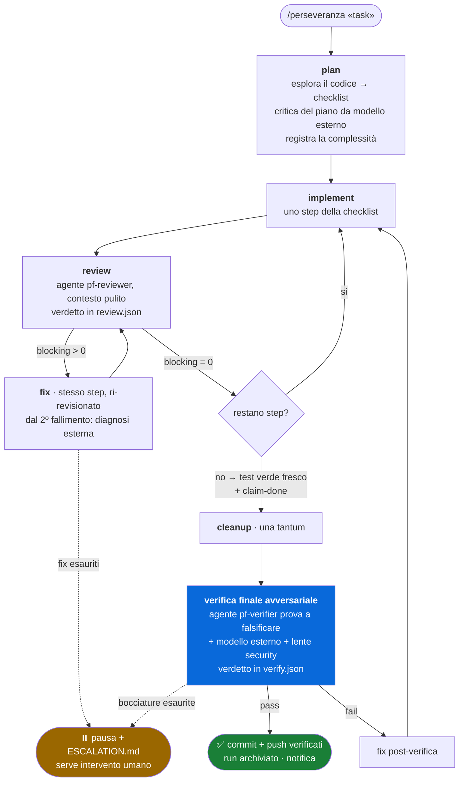

<div align="center">

# Perseveranza

**Dai un task a Claude Code e lascialo lavorare finché non è davvero finito.**


*[English](README.en.md)*

</div>

Perseveranza è un plugin per [Claude Code](https://claude.com/claude-code) che trasforma
una richiesta in un **ciclo autonomo a feedback**: Claude esplora il codice, scrive un
piano, implementa uno step alla volta, fa revisionare ogni step da un agente con contesto
pulito, e può dirsi "finito" solo dopo una **verifica finale avversariale** che prova a
smontare il lavoro. Alla fine trovi commit e push verificati, un archivio del run e una
notifica sul desktop. Se serve un umano, il loop si ferma e ti lascia un passaggio di
consegne scritto.

Zero dipendenze: gira su Node.js, lo stesso runtime di Claude Code. Dormiente finché non lo
armi: nelle chat normali non esiste.

## In 30 secondi

Dentro Claude Code, un comando alla volta:

```
/plugin marketplace add https://github.com/ilmondovero/perseveranza
```

```
/plugin install perseveranza@perseveranza
```

Poi, nel progetto su cui vuoi lavorare:

```
/perseveranza aggiungi la paginazione all'endpoint /orders, con test
```

Da qui Claude scrive il piano in `.omc-loop/plan.md` e il ciclo va avanti da solo: a ogni
fine risposta lo Stop hook inietta l'istruzione della fase successiva, in italiano, con una
riga di avanzamento in testa:

```
[perseveranza v2.0.0 · ▸impl ▰▰▱▱▱ 2/5 · it7/23 · 84k tok] Task: aggiungi la paginazione…
```

Quando è finito ricevi la notifica «Progetto finito e verificato · commit+push confermati».

## Perché esiste

Un agente che lavora da solo tende a **dichiararsi finito troppo presto**: il caso comune
funziona, i casi limite no, i test "passano" nella sua testa. Un principal ex-Meta che ha
messo un validatore davanti al suo agente misura che il **68% delle modifiche** conteneva
bug da correggere prima della PR
([Kun Chen, `no-mistakes`](https://blog.bytebytego.com/p/an-ex-meta-l8s-agentic-engineering)).

Perseveranza nasce da tre principi:

1. **Anello chiuso, non metronomo.** Le fasi non ruotano alla cieca: una review bocciata
   rimanda al fix dello stesso step, una promossa fa avanzare la checklist. Il routing è una
   tabella nel codice, non un'abitudine del modello.
2. **Ciclo interno economico, gate di uscita severo.** La review per step è leggera. Il
   controllo costoso (verifica avversariale, lente security, modello esterno) scatta una
   volta sola, quando Claude dichiara di aver finito. Dichiararsi finiti non chiude il
   ciclo: **innesca il controllo**.
3. **Prove, non parole.** I test li esegue lo script, non li racconta Claude. I verdetti
   sono file JSON scritti dai revisori. La chiusura git è verificata sui fatti. Un esito
   mancante non è mai una promozione.

## Come funziona


```mermaid
flowchart TD
    START(["/perseveranza «task»"]) --> PLAN
    PLAN["<b>plan</b><br/>esplora il codice → checklist<br/>critica del piano da modello esterno<br/>registra la complessità"] --> IMPL
    IMPL["<b>implement</b><br/>uno step della checklist"] --> REV
    REV["<b>review</b><br/>agente pf-reviewer, contesto pulito<br/>verdetto in review.json"] -- "blocking > 0" --> FIX
    FIX["<b>fix</b> · stesso step, ri-revisionato<br/>dal 2º fallimento: diagnosi esterna"] --> REV
    REV -- "blocking = 0" --> NEXT{"restano step?"}
    NEXT -- "sì" --> IMPL
    NEXT -- "no → test verde fresco<br/>+ claim-done" --> CLEAN
    CLEAN["<b>cleanup</b> · una tantum"] --> VERIFY
    VERIFY["<b>verifica finale avversariale</b><br/>agente pf-verifier prova a falsificare<br/>+ modello esterno + lente security<br/>verdetto in verify.json"] -- "pass" --> DONE
    VERIFY -- "fail" --> POSTFIX["fix post-verifica"] --> IMPL
    FIX -. "fix esauriti" .-> PAUSE
    VERIFY -. "bocciature esaurite" .-> PAUSE
    DONE(["✅ commit + push verificati<br/>run archiviato · notifica"])
    PAUSE(["⏸️ pausa + ESCALATION.md<br/>serve intervento umano"])

    style DONE fill:#1a7f37,color:#fff
    style PAUSE fill:#9a6700,color:#fff
    style VERIFY fill:#0969da,color:#fff
```

| fase | chi la fa | cosa produce |
|---|---|---|
| **plan** | Claude, dopo aver esplorato il codice | `plan.md` come checklist, complessità registrata |
| **implement** | Claude (o `pf-executor` con opus se la complessità è alta) | uno step, con i suoi casi limite |
| **review** | `pf-reviewer`, contesto pulito, modello per complessità | `review.json` con `blocking` e findings |
| **fix** | Claude, sullo stesso step | il fix, che torna in review |
| **cleanup** | Claude, una volta sola | codice morto e duplicazioni rimossi, docs aggiornati |
| **verifica finale** | `pf-verifier` che assume che il lavoro sia sbagliato | `verify.json` con `pass` e findings |
| **chiusura** | lo Stop hook, non Claude | commit, push, archivio del run, notifica |

Il modello dei revisori segue la complessità che Claude registra: `haiku` / `sonnet` /
`opus` per la review, `sonnet` / `opus` / `opus` per la verifica finale; con `high` la
verifica aggiunge una lente security.

## Le garanzie

- **Il test lo esegue lo script.** Il verbo `test` lancia la suite, registra l'exit code
  reale e un'impronta del working tree. Il `claim-done` è accettato solo con un run verde
  fresco e con il codice non toccato dopo.
- **I verdetti hanno uno schema.** `review.json` e `verify.json` sono validati; se il
  verdetto dichiarato e i findings non concordano vince la lettura più severa; un file
  malformato o mancante conta come bocciatura, in review come al gate finale.
- **La chiusura git è verificata sui fatti.** Working tree pulito e HEAD non avanti
  all'upstream, entro la deadline dell'hook. Se non è confermata il loop si ferma in
  `git-finish` e ti dice cosa manca; `resume` ritenta. `.omc-loop/` non finisce mai nel
  commit.
- **Niente si perde.** A fine run `.omc-loop/` (journal, piano, note, pareri esterni) viene
  archiviata in `~/.perseveranza/runs/` con un `summary.json`: `runs list`, `runs show`.
- **Tetti e interruttori.** Iterazioni adattive dal piano o `--max`, token reali con
  `--budget-tokens`, fix per step con `--max-retries`. Kill switch da qualunque sessione:
  il file `.omc-loop/STOP` o `OMC_LOOP_KILL=1`.
- **Un loop, una sessione.** La prima sessione che fa fire rivendica il loop; le altre non
  lo toccano. N `git worktree` = N loop paralleli.

## Comandi

Le opzioni di `/perseveranza`:

| opzione | effetto |
|---|---|
| `--max N` | tetto di iterazioni (altrimenti adattivo: `8 + 3 × step`, massimo 60) |
| `--budget-tokens N` | tetto di token, misurati dalla trascrizione della sessione |
| `--max-retries N` | fix concessi per step prima della pausa (default 3) |
| `--commit` | commit atomico dopo ogni step validato |
| `--test "cmd"` | la suite (se non la passi, Claude la individua) |
| `--approve-plan` | pausa dopo il piano: approvi tu con `resume` |
| `--external off` | nessun confronto con modelli esterni |
| `--no-git-finish` / `--no-push` | niente commit+push a fine progetto / solo commit locale |
| `--lang en` | istruzioni in inglese (default: italiano) |

I verbi con cui Claude, e tu, parlate al loop (`node "<root>/src/cli/omc-loop.mjs" <verbo>`):

| verbo | cosa fa |
|---|---|
| `status` · `history` · `explain` | sintesi leggibile · il journal del run · tabella delle transizioni e prossimi esiti |
| `test -- <cmd>` | esegue la suite e registra la prova |
| `report` · `complexity` · `claim-done` | segnali di Claude verso il loop |
| `pause` · `resume` | sospende / riprende (resume azzera i retry) |
| `ask <provider> <slot> -- <prompt>` | parere di un modello esterno, salvato come artefatto |
| `providers [list\|check\|enable]` | provider esterni; `check` prova la vita e spegne i morti |
| `runs [list\|show <id>]` | l'archivio dei run |
| `prompts [keys\|show\|layers\|validate]` | il prompt pack e i suoi livelli |
| `config` · `hud on\|off` | configurazione locale · statusline |
| `disarm` · `arm --force` | ferma il loop (archiviandolo) · sovrascrive un loop armato |

## Configurazione

`~/.perseveranza/config.json`, mai nel repo:

```json
{
  "lang": "it",
  "ollama": { "apiKey": "<chiave>", "model": "glm-5.3#low,deepseek-v4-flash:0731#none" },
  "providers": { "disabled": ["codex"], "timeouts": { "ollama-cloud": 300000 } }
}
```

- **Lingua.** Le istruzioni iniettate sono in italiano (`packs/it.json`). Precedenza:
  `--lang` > `PERSEVERANZA_LANG` > `lang` nel config > italiano. La locale della shell non
  conta.
- **Modelli esterni.** Auto-rilevati all'arm: `codex`, `agy`, `grok`, `cursor`, la stessa
  `claude` come controprova a contesto pulito, `ollama-cloud` via API. Il prompt non passa
  mai da una shell; le CLI che auto-approvano girano in una directory temporanea. Un
  rifiuto di policy o un timeout non è un finding: il verdetto vincolante resta quello del
  verificatore.
- **Reasoning per modello** (solo `ollama-cloud`). Ogni voce di `model` può portare il proprio
  sforzo di ragionamento dopo un `#`: `glm-5.3#low`, `deepseek-v4-flash:0731#none`. Valori:
  `high`, `medium`, `low`, `max`, `true`, `false` (alias di `false`: `none`, `off`); senza
  `#` vale il default del modello. Il separatore è `#` perché i due punti già separano il tag
  ollama. Un valore non riconosciuto è rifiutato in locale, senza spendere una chiamata.
- **Prompt pack.** Ogni istruzione di fase è un template sovrascrivibile. Livelli, dal più
  forte: `OMC_PROMPT_PACK=<file>` → `.omc-loop/prompts.json` → `packs/<lang>.json` →
  default. Un pack cambia cosa si dice, mai il routing.
- **Notifiche.** BurntToast su Windows, `osascript` su macOS, `notify-send` su Linux;
  silenziose se assenti. **HUD.** `hud on` aggiunge la riga di avanzamento alla statusline,
  componendola con quella esistente.

Requisiti: Claude Code e Node.js ≥ 20. Installazione manuale in alternativa al plugin:
`node install.mjs` (mai le due insieme). Tetti e timeout: [docs/loop-budget.md](docs/loop-budget.md).

<details>
<summary><b>La tabella delle transizioni</b> (generata dal codice con <code>npm run explain -- --markdown</code>; un test la confronta con questa copia)</summary>

<!-- transitions:start -->
| phase | outcome | next | action |
|---|---|---|---|
| plan | no-plan | plan | `plan-write`; asked once; a second miss still goes to implement |
| plan | approval | plan | `plan-approval`; pause; --approve-plan, once |
| plan | ready | implement | `implement-first`; adaptive budget set here when --max was not given |
| implement | always | review | `review-delegate`; drops a stale review.json |
| review | pass | implement | `review-advance`; retries reset |
| review | fail | implement | `review-fix`; retries++; external diagnosis from the 2nd fix |
| review | fail-limit | review | pause + escalation (fixes exhausted) |
| review | missing | review | `review-missing-outcome`; asked once |
| review | missing-twice | implement | `review-fix`; counts as a failed review |
| any | claim-open | unchanged | `claim-open-steps`; claim-done refused: unchecked steps |
| any | claim-no-test | unchanged | `claim-no-fresh-test`; claim-done refused: no fresh green test |
| any | claim-stale | unchanged | `claim-stale-test`; claim-done refused: code changed after the test |
| any | claim-first | cleanup | `cleanup`; once per run |
| any | claim-again | final-verify | `final-verify`; drops a stale verify.json |
| cleanup | always | final-verify | `final-verify` |
| final-verify | pass | git-finish | commit+push within the deadline, archive, disarm, notify |
| final-verify | fail | implement | `verify-postfix`; finalFails++ |
| final-verify | fail-limit | final-verify | pause + escalation |
| final-verify | missing | final-verify | `verify-missing-outcome`; asked once |
| final-verify | missing-twice | implement | `verify-postfix`; counts as a failed verification |
| git-finish | retry | git-finish | after resume: retry the closure |
| any | budget | disarm | iterations or tokens exhausted: archive, disarm, notify |
| any | kill | disarm | STOP file or OMC_LOOP_KILL: before any other check |
| any | unknown-phase | plan | `phase-recovered`; tampered state: restart from the plan |
<!-- transitions:end -->

</details>

## Sotto il cofano

Il motore è un **core puro** (`src/core/`): una macchina a stati che riceve stato e fatti e
restituisce il nuovo stato più una lista di effetti; la **shell** (`src/shell/`) legge
l'evento Stop, raccoglie i fatti, esegue gli effetti. Lo stato vive in
`.omc-loop/state.json`, raggruppato per proprietario: l'hook scrive fase e contatori, i
verbi scrivono i segnali, `arm` scrive opzioni e limiti. Ogni evento finisce in
`journal.jsonl`.

```bash
npm test          # unit (core, senza processi) + verbi + e2e (hook e git) + packaging
```

La CI gira su Ubuntu, macOS e Windows con Node 20 e 22. Per chi vuole entrare nel codice:
[docs/REVIEW-NOTES.md](docs/REVIEW-NOTES.md) (invarianti e trappole),
[CHANGELOG.md](CHANGELOG.md) (le decisioni e il loro perché),
[docs/PIANO-V2.md](docs/PIANO-V2.md) (il disegno da cui nasce la 2.x),
[bench/README.md](bench/README.md) (il bench che fa evolvere il prompt pack).

## Dalla 1.x

Stesso `.omc-loop/`, stessi verbi: un loop 1.x ancora armato viene migrato al primo Stop.
L'installazione manuale vive ora in `~/.claude/perseveranza/` (rilancia `node install.mjs`).
Chiavi del pack rimosse: `review-advance-no-outcome`, `verify-failed-no-outcome`; nuova:
`claim-stale-test`. Disinstallazione: dal pannello `/plugin`, oppure
`node install.mjs --uninstall` (prima `hud off` se attivo).
