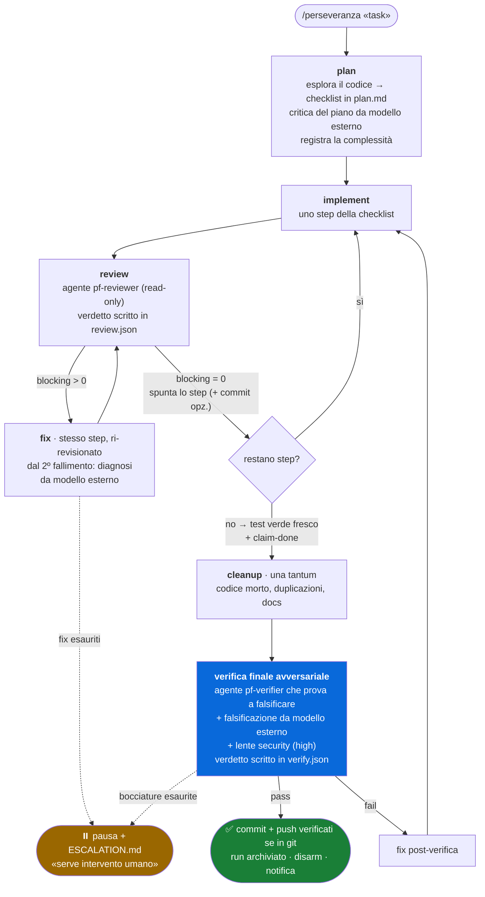

# Perseveranza


*[English version](README.en.md)*

**Dai un task a Claude Code e lascialo lavorare finché non è davvero finito.**

Perseveranza è un ciclo autonomo a feedback: Claude esplora il codice, scrive un piano,
implementa uno step alla volta, fa revisionare ogni step da un subagent con contesto
pulito e può dichiararsi "finito" solo superando una verifica finale avversariale
indipendente. Una notifica desktop ti avvisa quando il progetto è completo o quando
serve il tuo intervento.

Il motore è uno **Stop hook dormiente**: non fa nulla finché non lo armi con
`/perseveranza`, quindi non interferisce con le chat normali. Tutta la logica gira su
Node.js, lo stesso runtime di Claude Code, senza altre dipendenze.

## Il loop in un colpo d'occhio


```mermaid
flowchart TD
    START(["/perseveranza «task»"]) --> PLAN
    PLAN["<b>plan</b><br/>esplora il codice → checklist in plan.md<br/>critica del piano da modello esterno<br/>registra la complessità"] --> IMPL
    IMPL["<b>implement</b><br/>uno step della checklist"] --> REV
    REV["<b>review</b><br/>agente pf-reviewer (read-only)<br/>verdetto scritto in review.json"] -- "blocking > 0" --> FIX
    FIX["<b>fix</b> · stesso step, ri-revisionato<br/>dal 2º fallimento: diagnosi<br/>da modello esterno"] --> REV
    REV -- "blocking = 0<br/>spunta lo step (+ commit opz.)" --> NEXT{"restano step?"}
    NEXT -- "sì" --> IMPL
    NEXT -- "no → test verde fresco<br/>+ claim-done" --> CLEAN
    CLEAN["<b>cleanup</b> · una tantum<br/>codice morto, duplicazioni, docs"] --> VERIFY
    VERIFY["<b>verifica finale avversariale</b><br/>agente pf-verifier che prova a falsificare<br/>+ falsificazione da modello esterno<br/>+ lente security (high)<br/>verdetto scritto in verify.json"] -- "pass" --> DONE
    VERIFY -- "fail" --> POSTFIX["fix post-verifica"] --> IMPL
    FIX -. "fix esauriti" .-> PAUSE
    VERIFY -. "bocciature esaurite" .-> PAUSE
    DONE(["✅ commit + push verificati se in git<br/>run archiviato · disarm · notifica"])
    PAUSE(["⏸️ pausa + ESCALATION.md<br/>«serve intervento umano»"])

    style DONE fill:#1a7f37,color:#fff
    style PAUSE fill:#9a6700,color:#fff
    style VERIFY fill:#0969da,color:#fff
```

Tre principi guidano il disegno:

1. **Anello chiuso, non metronomo.** L'hook non ruota le fasi alla cieca: instrada in
   base agli esiti. Una review bocciata rimanda al fix dello stesso step; una promossa fa
   avanzare la checklist. La tabella delle transizioni è un dato del codice (verbo
   `explain`) ed è riprodotta [più sotto](#la-tabella-delle-transizioni).
2. **Ciclo interno economico, gate di uscita severo.** La review per step è leggera; il
   controllo costoso (verifica avversariale, security, modello esterno) scatta una sola
   volta, quando Claude dichiara di aver finito. Dichiararsi finiti non chiude il ciclo:
   **innesca il controllo**.
3. **Prove, non parole.** I test li esegue lo script stesso (verbo `test`: registra
   l'exit code reale e un'impronta del working tree), e il `claim-done` è accettato solo
   con un run verde fresco su codice non toccato dopo. I verdetti di review e verifica
   sono file JSON con schema, scritti dai revisori e consumati dall'hook; un esito
   mancante o malformato non è mai una promozione. La chiusura git è verificata sui fatti.

## Installazione (plugin, consigliata)

Dentro Claude Code, due comandi, **uno alla volta**:

```
/plugin marketplace add https://github.com/ilmondovero/perseveranza
```

```
/plugin install perseveranza@perseveranza
```

Usare l'**URL HTTPS completo**: la forma breve clona via SSH e fallisce sulle macchine
senza chiavi configurate. Gli aggiornamenti si prendono dal pannello `/plugin`.

### Requisiti

- [Claude Code](https://claude.com/claude-code) e Node.js ≥ 20 (arriva con lui).
- Nessuna dipendenza da altri plugin: gli agenti del ciclo (`pf-reviewer`, `pf-verifier`,
  `pf-executor`) sono inclusi.
- Opzionali, auto-rilevati per il secondo parere: CLI di modelli esterni (`codex`, `agy`,
  `grok`, `cursor-agent`, la stessa `claude` come controprova a contesto pulito) e/o
  `ollama-cloud` via API (chiave in `~/.perseveranza/config.json` o `OLLAMA_API_KEY`).
- Notifiche desktop (opzionali, fallback silenzioso): BurntToast su Windows, `osascript`
  su macOS, `notify-send` su Linux.

### Installazione manuale (alternativa)

```bash
git clone https://github.com/ilmondovero/perseveranza.git
cd perseveranza
node install.mjs
```

Copia in `~/.claude/perseveranza/` esattamente i file elencati in `manifest.mjs`, installa
comando e agenti e registra lo Stop hook in `~/.claude/settings.json` (idempotente, con
backup; rimuove le installazioni v1). Disinstallazione: `node install.mjs --uninstall`.
**Non usare le due modalità insieme**: due Stop hook guiderebbero lo stesso loop.

## Uso

```
/perseveranza implementa la feature X                 # budget adattivo dal piano
/perseveranza rifai il modulo Y --max 40              # tetto esplicito di iterazioni
/perseveranza feature Z --commit                      # commit atomico dopo ogni step validato
/perseveranza fix veloce --external off               # senza modelli esterni
/perseveranza feature W --no-git-finish               # niente commit+push a fine progetto
/perseveranza feature V --no-push                     # commit locale, niente push
/perseveranza feature K --approve-plan                # pausa dopo il piano: approvi tu con resume
/perseveranza feature J --budget-tokens 400000        # tetto di token oltre alle iterazioni
/perseveranza feature H --lang it                     # istruzioni iniettate in italiano
```

Claude scrive il piano in `.omc-loop/plan.md`, registra la complessità e da lì il ciclo
procede da solo: a ogni fine risposta lo Stop hook inietta l'istruzione della fase
successiva. La **lingua** delle istruzioni è inglese di default; `--lang it`, la variabile
`PERSEVERANZA_LANG=it`, `"lang": "it"` nel config o una locale italiana (`LANG`) attivano il
pack italiano incluso (`packs/it.json`), che copre tutte le istruzioni. Se scrivi il task
in italiano, il comando `/perseveranza` passa `--lang it` da solo.

### I verbi

```
node "<root>/src/cli/omc-loop.mjs" <verbo>
```

| verbo | cosa fa |
|---|---|
| `arm "<task>" [flag]` | arma il loop; **rifiuta** se già armato (`--force` per sovrascrivere) |
| `test -- <cmd>` | esegue la suite in prima persona: exit code reale + impronta del working tree |
| `report pass\|fail` | esito della fase corrente, solo se il revisore non ha scritto il verdetto |
| `complexity low\|medium\|high` | instrada i modelli di review, verifica e implementazione |
| `claim-done` | dichiara il progetto completo → cleanup + verifica finale |
| `ask <provider> <slot> -- <prompt>` | parere di un modello esterno, salvato in `external-<slot>-*.md` |
| `pause` / `resume` | sospende / riprende (resume azzera i retry e rimuove l'escalation) |
| `status` | sintesi leggibile (`--json` per lo stato grezzo) |
| `history [--tail N]` | il journal del run in forma leggibile |
| `explain [--markdown]` | tabella delle transizioni e prossimi esiti dalla fase corrente |
| `providers [list\|check\|enable]` | provider esterni; `check` prova la vita e disabilita i morti |
| `runs [list\|show <id>]` | archivio dei run passati (`~/.perseveranza/runs/`) |
| `prompts [keys\|show\|layers\|validate]` | il prompt pack e i suoi override |
| `config` / `hud on\|off` | configurazione locale / statusline |
| `disarm [--no-archive]` | ferma e rimuove il loop (il run viene archiviato) |

## La tabella delle transizioni

Generata dal codice con `npm run explain -- --markdown`; un test la confronta con questa
copia. `any` = da qualsiasi fase; `unchanged` = la fase non cambia.

<!-- transitions:start -->
| phase | outcome | next | action |
|---|---|---|---|
| plan | no-plan | plan | `plan-write`; asked once; a second miss still goes to implement |
| plan | approval | plan | `plan-approval`; pause; --approve-plan, once |
| plan | ready | implement | `implement-first`; adaptive budget set here when --max was not given |
| implement | always | review | `review-delegate`; drops a stale review.json |
| review | pass | implement | `review-advance`; retries reset |
| review | fail | implement | `review-fix`; retries++; external diagnosis from the 2nd fix |
| review | fail-limit | review | pause + escalation (fixes exhausted) |
| review | missing | review | `review-missing-outcome`; asked once |
| review | missing-twice | implement | `review-fix`; counts as a failed review |
| any | claim-open | unchanged | `claim-open-steps`; claim-done refused: unchecked steps |
| any | claim-no-test | unchanged | `claim-no-fresh-test`; claim-done refused: no fresh green test |
| any | claim-stale | unchanged | `claim-stale-test`; claim-done refused: code changed after the test |
| any | claim-first | cleanup | `cleanup`; once per run |
| any | claim-again | final-verify | `final-verify`; drops a stale verify.json |
| cleanup | always | final-verify | `final-verify` |
| final-verify | pass | git-finish | commit+push within the deadline, archive, disarm, notify |
| final-verify | fail | implement | `verify-postfix`; finalFails++ |
| final-verify | fail-limit | final-verify | pause + escalation |
| final-verify | missing | final-verify | `verify-missing-outcome`; asked once |
| final-verify | missing-twice | implement | `verify-postfix`; counts as a failed verification |
| git-finish | retry | git-finish | after resume: retry the closure |
| any | budget | disarm | iterations or tokens exhausted: archive, disarm, notify |
| any | kill | disarm | STOP file or OMC_LOOP_KILL: before any other check |
| any | unknown-phase | plan | `phase-recovered`; tampered state: restart from the plan |
<!-- transitions:end -->

## Il contratto: chi possiede cosa

`.omc-loop/state.json` (schema v2) è raggruppato per proprietario:

- **l'hook** scrive `phase`, `counters`, `flags`, `owner`, `usage`;
- **i verbi** scrivono `signals` (`report`, `claim-done`, `pause`/`resume`) e `lastTest`;
- **`arm`** scrive `options` e `limits` (il budget adattivo ritocca `maxIterations` una
  volta, dopo il piano, solo se `--max` non era esplicito).

Uno stato v1 (1.x) trovato dall'hook viene migrato al primo fire. Gli altri file del
ciclo: `plan.md` e `notes.md` (li gestisce Claude), `review.json` / `verify.json`
(artefatti dei revisori, consumati alla lettura), `journal.jsonl` (una riga per evento),
`external-*.md` (pareri esterni), `ESCALATION.md` (handoff quando il loop si ferma).

## Routing dei modelli per complessità

| fase | low | medium | high |
|---|---|---|---|
| code review (subagent) | haiku | sonnet | opus |
| verifica finale (subagent) | sonnet | opus | opus |
| implement | in sessione | in sessione | delegata a `pf-executor` con opus |

Con `high` la verifica finale include una lente security.

## Budget, kill switch, escalation

- **Iterazioni**: `--max N`, altrimenti adattivo dopo il piano (`8 + 3 × step`, massimo 60).
  La rampa di uscita (cleanup, verifica, chiusura) ha 3 iterazioni di margine.
- **Token**: `--budget-tokens N` misura i token reali dalla trascrizione della sessione
  (best-effort: se la trascrizione non è leggibile il tetto resta a iterazioni).
- **Fix per step**: `--max-retries N` (default 3) fix concessi davvero; alla bocciatura
  successiva il loop si mette in pausa e scrive `ESCALATION.md`.
- **Kill switch**: `.omc-loop/STOP` (file) o `OMC_LOOP_KILL=1`: al primo Stop il loop si
  disarma, prima di ogni altro controllo e da qualunque sessione.
- **Timeout**: hook 120 s (`OMC_HOOK_TIMEOUT_MS`, il push ha un tetto di 45 s dentro la
  deadline), test 30 min (`OMC_TEST_TIMEOUT_MS`), parere esterno 3 min
  (`OMC_ASK_TIMEOUT_MS` o `providers.timeouts` nel config), takeover di sessione 6 h
  (`OMC_SESSION_TAKEOVER_MS`).

Dettagli in [docs/loop-budget.md](docs/loop-budget.md).

## Chiusura e archivio del run

A verifica passata l'hook fa `git add -A` (mai `.omc-loop/`), commit `perseveranza: <task>`
e push, entro la deadline dell'hook, e verifica **sui fatti** che siano avvenuti (working
tree pulito, HEAD non avanti all'upstream). Se la chiusura non è confermata il loop va in
pausa nella fase `git-finish` con il motivo; `resume` ritenta. Il corpo del commit annota
i file già sporchi all'arm e l'eventuale assenza di un parere esterno riuscito al gate.

Poi `.omc-loop/` viene **archiviata** in `~/.perseveranza/runs/<progetto>/<timestamp>/`
con un `summary.json` (esito, iterazioni, token, verdetti, test, pareri): `runs list`,
`runs show <id>`. Anche `disarm`, il kill switch e l'esaurimento del budget archiviano.

## Prompt pack

Le istruzioni di fase sono template sovrascrivibili (`src/core/prompts.mjs`,
placeholder `{{...}}`). Livelli, dal più forte: `OMC_PROMPT_PACK=<file>` →
`.omc-loop/prompts.json` → `packs/<lang>.json` → default. Un pack cambia *cosa si dice*,
mai il routing; l'header di progresso lo antepone sempre l'hook; un pack rotto fa
ricadere sul livello successivo e viene annotato nel journal. `prompts validate <file>`
controlla chiavi e placeholder; `prompts layers` mostra i livelli attivi.

## Modelli esterni

Registro in `src/providers/registry.mjs`: `codex`, `agy`, `grok`, `cursor`, `claude`
(CLI) e `ollama-cloud` (API). Il prompt non passa mai da una shell (stdin o argv puri);
le CLI che auto-approvano girano in una directory temporanea. `providers check` manda un
prompt banale a ciascun provider rilevato e disabilita nel config quelli morti, con data e
motivo (`providers enable <id>` per riattivarli). Un rifiuto di policy o un timeout non è
mai un finding: il verdetto vincolante resta `verify.json`.

Config locale in `~/.perseveranza/config.json` (mai nel repo):

```json
{ "lang": "it",
  "ollama": { "apiKey": "<chiave>", "model": "glm-5.2,kimi-k2.7-code" },
  "providers": { "disabled": ["codex"], "timeouts": { "ollama-cloud": 300000 } } }
```

## Stato di avanzamento (HUD)

L'header di ogni istruzione iniettata mostra fase, barra degli step, iterazioni e token.
`hud on` attiva la stessa riga nella statusline di Claude Code, **componendola** con
quella esistente (che viene salvata e ripristinata da `hud off`).

## Più task in parallelo

N `git worktree` = N `.omc-loop/` indipendenti = N loop paralleli, ognuno rivendicato
dalla prima sessione che fa fire. Serve un upstream per branch (o `--no-push`);
`.omc-loop/STOP` è selettivo per worktree, `OMC_LOOP_KILL` è globale.

## Sviluppo

```bash
npm test                 # tutto: unit (core puro) + verbi + e2e (hook e git) + packaging
npm run test:unit        # solo il core, senza processi
npm run explain -- --markdown
```

La CI gira su Ubuntu, macOS e Windows con Node 20 e 22. Invarianti e trappole per chi
rivede il codice: [docs/REVIEW-NOTES.md](docs/REVIEW-NOTES.md). Storia delle decisioni:
[CHANGELOG.md](CHANGELOG.md). Il piano da cui nasce la v2: [docs/PIANO-V2.md](docs/PIANO-V2.md).
Il bench per far evolvere il prompt pack: [bench/README.md](bench/README.md).

## Migrare dalla 1.x

- Stesso path `.omc-loop/`, stessi verbi: il comando `/perseveranza` continua a funzionare.
- Uno stato 1.x armato viene migrato al primo Stop (riga `migrate` nel journal).
- Le istruzioni sono in inglese di default: per l'italiano `--lang it` o `"lang": "it"`
  nel config (il comando lo fa da solo se il task è in italiano).
- Chiavi del pack rimosse: `review-advance-no-outcome`, `verify-failed-no-outcome` (un
  esito mancante due volte ora è una bocciatura); nuova: `claim-stale-test`.
- `history.log` → `journal.jsonl` (verbo `history`); l'installazione manuale vive in
  `~/.claude/perseveranza/` (rilanciare `node install.mjs`, che rimuove i file v1).

## Disinstallazione

Plugin: dal pannello `/plugin`. Manuale: `node install.mjs --uninstall`. Se attivo,
prima `hud off`.
