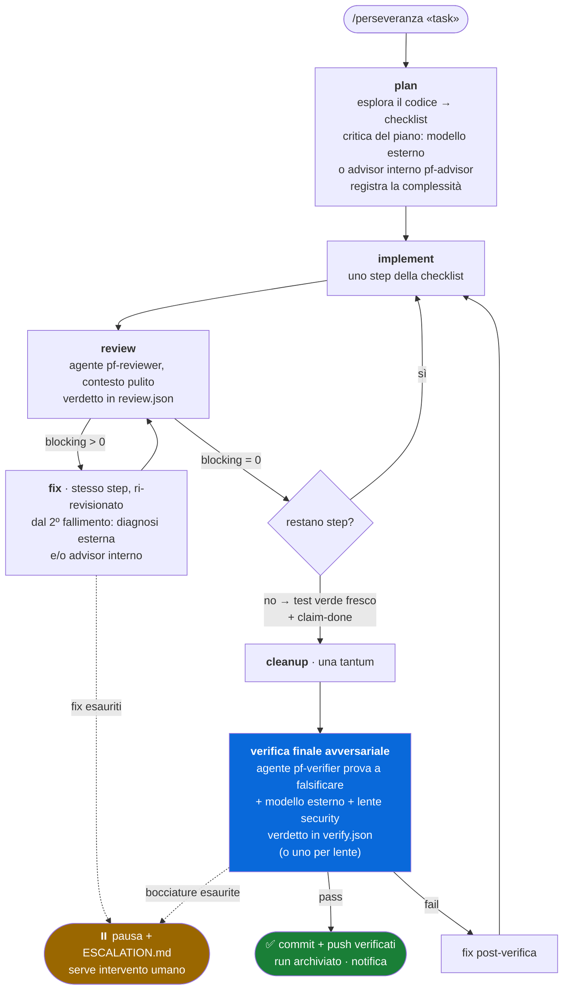

<div align="center">

# Perseveranza

**Dai un task a Claude Code e lascialo lavorare finché non è davvero finito.**


*[English](README.en.md)*

</div>

Perseveranza è un plugin per [Claude Code](https://claude.com/claude-code) che trasforma
una richiesta in un **ciclo autonomo a feedback**: Claude esplora il codice, scrive un
piano, implementa uno step alla volta, fa revisionare ogni step da un agente con contesto
pulito, e può dirsi "finito" solo dopo una **verifica finale avversariale** che prova a
smontare il lavoro. Alla fine trovi commit e push verificati, un archivio del run e una
notifica sul desktop. Se serve un umano, il loop si ferma e ti lascia un passaggio di
consegne scritto.

Zero dipendenze: gira su Node.js, lo stesso runtime di Claude Code. Dormiente finché non lo
armi: nelle chat normali non esiste.

## Installazione

Requisiti: **Claude Code 2.1.287 o successivo, nella CLI** (`claude`, anche `claude -p`) e
Node.js ≥ 20. Dalla 3.0 Perseveranza è una [mod](#la-mod): l'app Desktop e l'estensione
VS Code non guidano il loop ([requisiti completi](#requisiti)). Tre modi, **mai due insieme**:
due copie della mod guiderebbero lo stesso loop.

1. **Dal marketplace** (consigliato). Dentro Claude Code, un comando alla volta:

   ```
   /plugin marketplace add https://github.com/ilmondovero/perseveranza
   ```

   ```
   /plugin install perseveranza@perseveranza
   ```

   Aggiornamento: `claude plugin update perseveranza@perseveranza`. Disinstallazione: dal
   pannello `/plugin`.
2. **Da una cartella, per una sessione** (sviluppo e prove): `claude --plugin-dir <checkout>`.
   Claude Code scrive nella cartella `.claude-plugin/types/` e, se manca, un `tsconfig.json`
   (nel repository sono in `.gitignore`).
3. **Installazione manuale**: `node install.mjs` copia il plugin in `~/.claude/perseveranza/` e
   lo fa caricare con `CLAUDE_CODE_PLUGIN_DIRS` nell'`env` di `~/.claude/settings.json`, il modo
   documentato per un plugin che non viene da un marketplace. Non scrive hook di impostazioni e
   toglie quelli lasciati da un'installazione manuale 1.x o 2.x: solo un hook che esegue
   esattamente uno dei loro script, e solo se quello script è ancora il loro (non c'è più, o è
   identico a una release). Un tuo script con un nome simile resta; un hook che esegue un loro
   script che hai modificato resta anche lui, e viene elencato.
   - **Cosa cancella, e nient'altro.** (a) I file elencati dal suo marcatore,
     `~/.claude/perseveranza/.perseveranza-install.json` (ogni file con dimensione e sha256), se
     sono ancora come li ha scritti, e i file che Claude Code genera in una cartella di plugin
     che riconosce come sua. (b) I file lasciati da un'installazione 1.x o 2.x che sono
     **identici byte per byte** a quelli di una release passata: le impronte sono in
     `src/shell/legacy-hashes.mjs`, calcolate dalla storia git e verificate dai test.
     (c) Gli avanzi di una sua esecuzione interrotta, riconosciuti dal file che ci scrive per
     primo (`.perseveranza-staging.json`, con pid, ora e un valore casuale che compaiono anche nel
     nome della cartella), e solo se quel processo non c'è più. **Tutto il resto lo segnala e
     basta**: un tuo file con il nome di uno vecchio, una vecchia copia che hai modificato, una
     cartella chiamata come un avanzo restano dove sono, elencati con "Left alone ... remove it
     yourself". Se `~/.claude/hooks`, `agents` o `commands` è un link o una junction (per
     esempio verso un repository di dotfiles), lì dentro non cancella niente e lo dice.
   - **La cartella.** Sostituisce o toglie solo una cartella col suo marcatore completo, o una
     senza marcatore (2.x, o un marcatore cancellato) i cui file sono tutti copie esatte di una
     release. Rifiuta, senza cancellare niente e dicendo cosa fare, un checkout git, un link o
     una junction, il checkout da cui gira, un marcatore illeggibile o di un altro plugin, e una
     cartella con file che non ha scritto lei o che sono cambiati. `--uninstall` toglie solo i
     file del marcatore ancora intatti e lascia i tuoi (e il marcatore se ne va: una nuova
     installazione su quella cartella la rifiuta finché non sposti i tuoi file). Se
     l'installazione c'è già, uguale file per file, non ricopia niente e lo dice.
   - **Interruzioni e concorrenza.** La copia nuova si prepara a parte e si verifica contro il
     marcatore riletto dal disco; poi prende il posto della vecchia con due rename.
     `settings.json` si scrive solo dopo. Se un'installazione si interrompe, la successiva
     rimette a posto la copia vecchia più recente se è completa, o pulisce i suoi avanzi. Due
     `install.mjs` sulla stessa cartella non girano insieme: il secondo aspetta il lucchetto
     `~/.claude/.perseveranza-install.lock` (fino a 10 s) e poi si ferma spiegando cosa fare.
     Un lucchetto il cui processo non c'è più viene ripreso subito.
   - **`settings.json`.** Lo modifica come testo: scrive o toglie la sua voce e toglie gli
     hook vecchi; **ogni altro byte resta com'era** (numeri come li hai scritti, array in linea,
     spazi, escape, chiavi ripetute). Il risultato deve dare esattamente le impostazioni attese,
     altrimenti rifiuta senza toccare niente (succede solo se una chiave che deve cambiare è
     scritta due volte). Installare e poi disinstallare restituisce lo stesso file byte per byte,
     con tre eccezioni: la voce che aggiunge è scritta come i membri accanto; il valore di
     `CLAUDE_CODE_PLUGIN_DIRS`, quando cambia, è scritto in JSON standard (un escape non
     necessario diventa il carattere); un file vuoto diventa `{}`, e un `"env": {}` vuoto che
     c'era già sparisce. La voce si confronta sul percorso reale: la stessa cartella scritta in
     un altro modo (nome 8.3, junction, `subst`) non viene aggiunta due volte, e
     `--uninstall` le toglie tutte. La prima volta che cambia un file che esisteva già ne fa una
     copia, `settings.json.bak-perseveranza-3.0`, anche se c'è il `settings.json.bak-perseveranza`
     lasciato dalla 2.x (che non tocca). Non la sovrascrive mai e non scrive attraverso niente
     che abbia già quel nome (nemmeno un link rotto). Se il file l'ha creato lei e contiene solo
     la sua voce, `--uninstall` lo cancella. Tiene i permessi, un BOM iniziale e un link
     simbolico (scrive nel file a cui punta). Rifiuta senza cambiare niente un file che non è
     JSON valido. Rilanciato non cambia nulla.

   `--claude-dir <cartella>` sceglie un'altra cartella di configurazione (altrimenti
   `CLAUDE_CONFIG_DIR`, poi `~/.claude`). Disinstallazione: `node install.mjs --uninstall`
   (prima `hud off` se attivo).

Per controllare: in una sessione nuova `/pf status` risponde subito, senza un turno del
modello. Se `/pf` non esiste la mod non è caricata: vedi
[risoluzione dei problemi](#risoluzione-dei-problemi).

## Uso

Nel progetto su cui vuoi lavorare:

```
/perseveranza aggiungi la paginazione all'endpoint /orders, con test
```

Da qui Claude arma il loop, scrive il piano in `.perseveranza/plan.md` e il ciclo va avanti da
solo: a ogni fine risposta la mod inietta l'istruzione della fase successiva, in italiano, con
una riga di avanzamento in testa:

```
[perseveranza v3.0.1 · ▸impl ▰▰▱▱▱ 2/5 · it7/23 · 84k tok] Task: aggiungi la paginazione…
```

Quando è finito ricevi la notifica «Progetto finito e verificato · commit+push confermati».
Intanto `/pf status` ti dice a che punto è, anche mentre Claude lavora; `/pf help` elenca gli
altri verbi ([il comando `/pf`](#usare-la-mod)).

## Perché esiste

Un agente che lavora da solo tende a **dichiararsi finito troppo presto**: il caso comune
funziona, i casi limite no, i test "passano" nella sua testa. Un principal ex-Meta che ha
messo un validatore davanti al suo agente misura che il **68% delle modifiche** conteneva
bug da correggere prima della PR
([Kun Chen, `no-mistakes`](https://blog.bytebytego.com/p/an-ex-meta-l8s-agentic-engineering)).

Perseveranza nasce da tre principi:

1. **Anello chiuso, non metronomo.** Le fasi non ruotano alla cieca: una review bocciata
   rimanda al fix dello stesso step, una promossa fa avanzare la checklist. Il routing è una
   tabella nel codice, non un'abitudine del modello.
2. **Ciclo interno economico, gate di uscita severo.** La review per step è leggera. Il
   controllo costoso (verifica avversariale, lente security, modello esterno) scatta una
   volta sola, quando Claude dichiara di aver finito. Dichiararsi finiti non chiude il
   ciclo: **innesca il controllo**.
3. **Prove, non parole.** I test li esegue lo script, non li racconta Claude. I verdetti
   sono file JSON scritti dai revisori. La chiusura git è verificata sui fatti. Un esito
   mancante non è mai una promozione.

## Come funziona


```mermaid
flowchart TD
    START(["/perseveranza «task»"]) --> PLAN
    PLAN["<b>plan</b><br/>esplora il codice → checklist<br/>critica del piano: modello esterno<br/>o advisor interno pf-advisor<br/>registra la complessità"] --> IMPL
    IMPL["<b>implement</b><br/>uno step della checklist"] --> REV
    REV["<b>review</b><br/>agente pf-reviewer, contesto pulito<br/>verdetto in review.json"] -- "blocking > 0" --> FIX
    FIX["<b>fix</b> · stesso step, ri-revisionato<br/>dal 2º fallimento: diagnosi esterna<br/>e/o advisor interno"] --> REV
    REV -- "blocking = 0" --> NEXT{"restano step?"}
    NEXT -- "sì" --> IMPL
    NEXT -- "no → test verde fresco<br/>+ claim-done" --> CLEAN
    CLEAN["<b>cleanup</b> · una tantum"] --> VERIFY
    VERIFY["<b>verifica finale avversariale</b><br/>agente pf-verifier prova a falsificare<br/>+ modello esterno + lente security<br/>verdetto in verify.json<br/>(o uno per lente)"] -- "pass" --> DONE
    VERIFY -- "fail" --> POSTFIX["fix post-verifica"] --> IMPL
    FIX -. "fix esauriti" .-> PAUSE
    VERIFY -. "bocciature esaurite" .-> PAUSE
    DONE(["✅ commit + push verificati<br/>run archiviato · notifica"])
    PAUSE(["⏸️ pausa + ESCALATION.md<br/>serve intervento umano"])

    style DONE fill:#1a7f37,color:#fff
    style PAUSE fill:#9a6700,color:#fff
    style VERIFY fill:#0969da,color:#fff
```

| fase | chi la fa | cosa produce |
|---|---|---|
| **plan** | Claude, dopo aver esplorato il codice; critica di un modello esterno o di `pf-advisor` | `plan.md` come checklist, complessità registrata |
| **implement** | Claude (o `pf-executor` con opus se la complessità è alta) | uno step, con i suoi casi limite |
| **review** | `pf-reviewer`, contesto pulito, modello per complessità | `review.json` con `requestId`, `blocking` e findings |
| **fix** | Claude, sullo stesso step; dal 2º tentativo con il parere di `pf-advisor` | il fix, che torna in review |
| **cleanup** | Claude, una volta sola | codice morto e duplicazioni rimossi, docs aggiornati |
| **verifica finale** | `pf-verifier` che assume che il lavoro sia sbagliato, uno per lente | `verify.json` (o un `verify-<lente>.json` per lente) con `requestId`, `pass` e findings |
| **chiusura** | la mod allo Stop, non Claude | commit, push, archivio del run, notifica |

Il modello dei revisori segue la complessità che Claude registra: `haiku` / `sonnet` /
`opus` per la review, `sonnet` / `opus` / `opus` per la verifica finale. Con `high` la
verifica finale si divide in tre lenti che lavorano in parallelo (vedi sotto).

## Le garanzie

- **Il test lo esegue lo script.** Il verbo `test` lancia la suite, registra l'exit code
  reale e un'impronta del working tree. Il `claim-done` è accettato solo con un run verde
  per l'albero attuale: nella stessa iterazione, o di un'iterazione precedente se il codice
  non è cambiato da allora (una modifica ai soli file di documentazione non conta).
- **La suite gira una volta per albero, non una per agente.** `test --if-needed` non
  rilancia una suite il cui verde è già registrato per lo stesso albero, e ogni fase riceve
  la "prova dei test" corrente, così Claude e i suoi subagent eseguono i test mirati invece
  di ripetere la suite intera per prudenza. Il verbo annota anche quali test sono falliti
  e segnala un rosso che sullo stesso albero non si ripete (un test instabile, non un bug).
- **Un verdetto consumato non si perde.** `review.json` e `verify.json` sono rinominati in
  `review-<n>.json` / `verify-<n>.json` quando il loop li legge: la fase di fix rilegge i
  findings da lì invece di richiederli al reviewer.
- **Uno stop senza modifiche non avanza.** Se il working tree è identico a quello dello
  stop precedente e nessun test è stato registrato (tipico: un subagent ancora in
  esecuzione quando il turno finisce), il loop chiede una volta di completare lo step
  invece di mandare il nulla in review.
- **I verdetti hanno uno schema.** `review.json` e `verify.json` sono validati; se il
  verdetto dichiarato e i findings non concordano vince la lettura più severa; un file
  malformato o mancante conta come bocciatura, in review come al gate finale.
- **La chiusura git è verificata sui fatti.** Working tree pulito e HEAD non avanti
  all'upstream, entro la deadline dell'hook. Se non è confermata il loop si ferma in
  `git-finish` e ti dice cosa manca; `resume` ritenta. `.perseveranza/` non finisce mai nel
  commit.
- **Niente si perde.** A fine run `.perseveranza/` (journal, piano, note, pareri esterni) viene
  archiviata in `~/.perseveranza/runs/` con un `summary.json`: `runs list`, `runs show`.
  Se l'archiviazione fallisce, i file restano in `.perseveranza` e il loop viene disattivato;
  `status` indica il recupero. Sistemata la destinazione, `disarm` ritenta l'archiviazione.
  Fino al recupero, `arm` impedisce di sovrascrivere il run conservato.
- **Tetti e interruttori.** Iterazioni adattive dal piano o `--max`, token reali con
  `--budget-tokens`, fix per step con `--max-retries`. Kill switch da qualunque sessione:
  il file `.perseveranza/STOP` o `PERSEVERANZA_KILL=1`.
- **Un loop, una sessione.** La prima sessione che fa fire rivendica il loop; le altre non
  lo toccano, mai, nemmeno dopo una notte di silenzio: il passaggio di mano è esplicito
  (`resume --takeover`). N `git worktree` = N loop paralleli.
- **Un loop orfano non resta invisibile.** Il loop vive negli Stop della sessione
  proprietaria: se quella muore (terminale chiuso, Esc a metà turno, crash) lo stato dice
  "fase review" per sempre. Perciò la mod, all'avvio, avvisa ogni nuova sessione aperta
  nella cartella che esiste un loop di un'altra sessione, da quanto tace e in che fase era,
  e chiede all'utente se riprenderlo (`resume --takeover`) o fermarlo (`disarm`). `status`,
  la HUD e il riepilogo di `disarm` mostrano l'età dell'ultimo fire (`STALE` oltre trenta minuti,
  `PERSEVERANZA_STALE_MS`); il journal registra il buco (`gap`).
- **Il loop ha un battito anche dentro il turno.** La mod vede ogni chiamata di uno strumento
  (le deleghe ad Agent, i tool di lavoro) e ogni ritorno di un subagent, e scrive
  `.perseveranza/activity.json`: l'età
  del silenzio si misura dall'ultimo segno di vita, non dall'ultimo Stop, e un subagent
  delegato e mai tornato si legge come tale ("delegato a pf-reviewer alle 11:10, non ancora
  tornato") in `status`, nella HUD e nell'avviso all'avvio di una sessione.
- **Una sentinella parla quando il loop tace.** A ogni Stop (e ad `arm`) parte un processo
  staccato che dorme fino alla soglia, si riallinea finché il loop dà segni di vita e, se il
  silenzio è vero, manda la notifica desktop e scrive `watchdog` nel journal e nel
  `summary.json`. Nessun cron, nessuna sessione da tenere aperta; `PERSEVERANZA_NO_WATCHDOG=1`
  la spegne.
- **Con `PERSEVERANZA_RESTORE=1` la sentinella sblocca.** Non esiste un'interfaccia per
  interrompere un tool in corso in Claude Code: l'unico interrupt è Esc. La sentinella fa
  quello che farebbe Esc: termina il processo Claude Code che guidava il loop (registrato
  allo Stop) e riapre la stessa sessione, stesso id, in una nuova console con un prompt di
  ripristino. Un turno appeso costa la soglia, non una notte. Tre segni di vita (Stop,
  attività dei tool, scrittura della trascrizione) e il battito del verbo `test` durante la
  suite fanno sì che trenta minuti di silenzio siano un turno morto, non lento. Due stadi:
  avviso a trenta minuti, kill e ripristino a sessanta (`PERSEVERANZA_RESTORE_AFTER_MS`),
  perché una sessione ferma su una domanda all'utente non scrive nulla e l'avviso è la sua
  occasione. Al massimo tre ripristini per run; nessun rilancio senza un processo
  registrato. Prima di terminare o lanciare qualcosa crea in esclusiva
  `.perseveranza/restore-launched.json` (chi lo crea vince il ripristino: due sentinelle che si
  credono entrambe proprietarie lanciano una volta sola) e scrive l'interruzione in
  `state.json`: se una delle due scritture fallisce, o se lo stato c'è solo nella sua copia in
  sospeso (una scrittura interrotta), avvisa e basta. Un secondo ripristino non parte finché la
  sessione riaperta non arriva a uno Stop. Quel file non blocca per sempre: datato nel futuro
  (un orologio tornato indietro) è scartato; uno rimasto da una sentinella morta prima del
  lancio è considerato abbandonato dopo il doppio della soglia di ripristino (almeno dieci
  minuti) e il tentativo conta fra i tre; una cartella al suo posto è spostata da parte. Uno di
  un lancio riuscito aspetta lo Stop della sessione riaperta, che può essere ferma su un prompt.
  Disattivo di default; verificato a mano su Windows prima di scriverlo.
  `PERSEVERANZA_CLAUDE_BIN` indica il binario `claude` se non è nel `PATH`;
  `PERSEVERANZA_ACTIVITY_HEARTBEAT_MS` regola il battito del verbo `test`.
- **Dopo un ripristino si riconcilia, in sola lettura.** La sessione riaperta ispeziona
  piano, note, diff e processi e scrive `.perseveranza/reconcile.json` (`complete`, `partial`,
  `uncertain`, con i comandi ancora in esecuzione). Finché non lo fa, la mod rifiuta
  modifiche, deleghe e comandi non di sola lettura: le istruzioni nel prompt non bastano,
  un tool rifiutato sì. `partial` continua lo step senza rifare il fatto, `complete` va in
  review, `uncertain` o un comando ancora vivo mettono in pausa per un umano. I contatori
  di retry non si azzerano: l'interruzione conta, non regala budget. La nuova sentinella
  concede alla sessione ripristinata un intero intervallo di avvio prima di valutarla di nuovo.
- **Ogni verdetto risponde a una richiesta precisa.** Ogni prompt che chiede un verdetto
  emette una richiesta nuova con il suo `requestId`, che l'agente copia nel file. Un
  `review.json` o `verify.json` con un id diverso risponde a una richiesta precedente (un
  subagent di un turno ucciso o di un giro precedente, un file rimasto attraverso un
  takeover), anche se è stato scritto dopo: viene messo da parte come
  `review-stale-<n>.json` e la fase richiede il verdetto, una volta. Un verdetto senza id
  (un pack di prompt più vecchio) vale se scritto dopo la richiesta; con l'id giusto vale
  anche se l'orologio del file è indietro.
- **La verifica finale può guardare con più lenti.** Con `--verifiers correctness,security,tests`
  (e di default con complessità `high`) Claude delega nello stesso messaggio, in primo
  piano, un verificatore per lente: `correctness` (logica, casi limite, input ostili,
  regressioni dei fix), `security` (segreti, input non fidati, injection, path traversal),
  `tests` (test mirati, casi non coperti, commenti e documentazione che dicono il vero).
  Ognuno scrive `verify-<lente>.json` con lo stesso `requestId`. Il giro passa solo se tutte
  le lenti hanno scritto e nessuna ha un finding `critical`; un `pass: false` senza critical
  è un pass con warning, annotato nel journal, salvo un finding `high`/`major` (quello blocca). Una lente mancante viene richiesta da sola,
  le altre restano valide; la seconda volta è una bocciatura. I findings di tutte le lenti
  finiscono, ciascuno con la sua lente, in un solo `verify-<n>.json`. Un `verify.json` del giro (un pack di prompt
  personalizzato che non conosce le lenti) copre ogni lente senza un file suo, e boccia il
  giro se boccia (`lens-fallback` nel journal). Con la sola lente `general` (il default fino a complessità `medium`) tutto
  resta com'era: un verificatore, `verify.json`.
- **Ogni bocciatura rende più forte il giro dopo.** I `verify-<n>.json` degli ultimi tre giri
  bocciati entrano nel prompt della verifica successiva: ogni verificatore deve controllare
  che quei difetti siano risolti e che i fix non abbiano introdotto regressioni.
- **Un secondo parere anche senza modelli esterni.** L'agente `pf-advisor` (contesto pulito,
  sola lettura sul sorgente, modello `opus` di default) interviene nei momenti in cui un
  secondo parere serve davvero: prima di consegnare il piano e quando lo stesso errore si
  ripresenta (dal 2º fix dopo una review bocciata, dalla 2ª bocciatura della verifica finale).
  Con modelli esterni rilevati è il ripiego se nessuno risponde; senza, è il secondo parere.
  Scrive un file di testo libero `.perseveranza/advisor-<slot>-<n>.md` (critica, tre rischi, cosa
  cambierebbe, cosa non ha potuto verificare): niente JSON, niente verdetto. Nel fix riceve
  tutti i tentativi già falliti sullo stesso step (`review-<n>.json`, `verify-<n>.json`), non
  deve riproporre un approccio già fallito e dice se il problema è lo step stesso: allora
  Claude riscrive lo step in `plan.md` prima di riprovare. È consultivo: non instrada mai il
  loop, e un parere mancante, vuoto o in errore non è un finding e non blocca (Claude lo
  annota in `notes.md`). Il journal registra ogni suggerimento (`advisor-hint`: slot e
  motivo `no-external`/`fallback`/`off`) per misurare quanto serve; `status` mostra
  `Advisor: on (opus)` o `off`. `--advisor off` lo spegne, `--advisor-model` o
  `PERSEVERANZA_ADVISOR_MODEL` scelgono il modello.
- **Un pass finale chiude solo ciò che ha giudicato.** Se al pass il piano ha di nuovo step
  aperti, l'ultimo run registrato della suite non è un verde sul codice giudicato (rosso,
  assente, o eseguito prima di una pulizia che ha toccato il codice) oppure il codice è
  cambiato dopo la richiesta di verifica, non si committa nulla e si torna in implement:
  serve un nuovo claim-done. Il codice è tutto ciò che git non ignora, documentazione
  esclusa: l'output di build o di test va in `.gitignore`, altrimenti i run del
  verificatore stesso lo cambiano. Dopo quattro pass che non coprono l'albero, senza
  bocciature in mezzo, il loop si mette in pausa per un umano. Fuori da git non c'è
  impronta da confrontare.

## Comandi

Le opzioni di `/perseveranza`:

| opzione | effetto |
|---|---|
| `--max N` | tetto di iterazioni (altrimenti adattivo: `8 + 3 × step`, massimo 60) |
| `--budget-tokens N` | tetto di token, misurati dalla trascrizione della sessione e da quelle dei suoi subagent |
| `--max-retries N` | fix concessi per step prima della pausa (default 3) |
| `--commit` | commit atomico dopo ogni step validato |
| `--test "cmd"` | la suite (se non la passi, Claude la individua) |
| `--approve-plan` | pausa dopo il piano: approvi tu con `/pf resume` (Claude non può) |
| `--verifiers <lenti>` | lenti della verifica finale tra `general`, `correctness`, `security`, `tests` (default `auto`: le ultime tre con complessità `high`, altrimenti `general`) |
| `--external off` | nessun confronto con modelli esterni |
| `--advisor off` | nessun advisor interno (default `on`) |
| `--advisor-model <nome>` | modello dell'advisor interno (default `PERSEVERANZA_ADVISOR_MODEL`, altrimenti `opus`) |
| `--check` | prova subito i provider rilevati: parte solo con quelli che rispondono |
| `--no-git-finish` / `--no-push` | niente commit+push a fine progetto / solo commit locale |
| `--lang en` | istruzioni in inglese (default: italiano) |

I verbi con cui Claude, e tu, parlate al loop (`node "<root>/src/cli/perseveranza.mjs" <verbo>`):

| verbo | cosa fa |
|---|---|
| `status` · `history` · `explain` | sintesi leggibile · il journal del run · tabella delle transizioni e prossimi esiti |
| `test [--if-needed] -- <cmd>` | esegue la suite e registra la prova; `--if-needed` la salta se un verde è già registrato per questo albero |
| `report` · `complexity` · `claim-done` | segnali di Claude verso il loop |
| `pause` · `resume [--takeover]` | sospende / riprende (resume azzera i retry; `--takeover` libera la sessione proprietaria: il prossimo Stop di chi lo esegue prende il loop dalla fase corrente) |
| `ask <provider> <slot> -- <prompt>` | parere di un modello esterno, salvato come artefatto |
| `providers [list\|check\|enable]` | provider esterni; `check` prova la vita e spegne i morti |
| `runs [list\|show <id>]` | l'archivio dei run |
| `prompts [keys\|show\|layers\|validate]` | il prompt pack e i suoi livelli |
| `config` · `hud on\|off` | configurazione locale · statusline |
| `disarm` · `arm --force` | ferma il loop (archiviandolo) · sovrascrive un loop armato |

Gli stessi verbi hanno altre due porte, che lanciano lo stesso CLI senza shell: il comando
`/pf` per te e lo strumento `perseveranza` per Claude ([usare la mod](#usare-la-mod)).

## La mod

### Cos'è

Dalla 3.0 Perseveranza è una **mod** di Claude Code: un plugin con un modulo di hook
(`hooks/register.js`, dichiarato in `hooks/hooks.json` sotto `modules`) che gira dentro Claude
Code invece che in un processo per ogni evento. È l'unico a guidare il loop: a ogni Stop chiede
al motore Node (il ponte `src/shell/mod-bridge.mjs`) la fase successiva e la inietta. Vede quello
che un hook di impostazioni non vedeva: i subagent ancora al lavoro (lo Stop li aspetta invece di
contare un verdetto mancante), i token di ogni richiesta al modello, per agente, un giudice che si
ferma senza verdetto (lo rimanda indietro), il modello dei subagent `pf-*` per complessità. In un
progetto senza un loop armato non avvia nessun processo. Registra il comando `/pf` e lo
strumento `perseveranza`.

### Requisiti

- **Claude Code 2.1.287 o successivo** (`claude --version`).
- **La CLI**: `claude` o `claude -p`. Non l'app Desktop né l'estensione VS Code: la mod raggiunge
  il motore con `$.process.run`, che Claude Code dà solo alla CLI. In quelle sessioni la mod non
  lascia il segno di vita e `arm` rifiuta (con `--no-mod-check` arma, ma lì niente guida il loop).
- **Le mod accese**: non con `--bare`, `--safe-mode`, `"disableAllHooks": true` nelle
  impostazioni o una policy dell'organizzazione (`allowManagedModsOnly`, `disableAllHooks`
  gestito). Uno spazio di lavoro deve essere fidato (il dialogo di fiducia accettato).
- **L'interruttore remoto acceso**: Claude Code può spegnere le mod da remoto e ricorda l'ultimo
  stato. Se è salvato spento, un `claude -p "ok"` con la rete lo aggiorna.
- **`node` raggiungibile da Claude Code** (sul suo `PATH`, o `PERSEVERANZA_NODE`).
- `claude -p --setting-sources project` non legge le impostazioni utente, dove vivono sia i
  plugin installati sia l'`env` di `install.mjs`: lì la mod si carica solo con `--plugin-dir`.

### Usare la mod

- **`/perseveranza <task>`** avvia un task: è il comando markdown, Claude arma il loop e scrive il
  piano.
- **`/pf <verbo>`** è il comando per te. Risponde subito, anche mentre Claude lavora, senza un
  turno del modello (in `claude -p "/pf status"` il codice d'uscita è quello del verbo). Un verbo
  che non prende parole rifiuta quelle in più (`/pf disarm la sveglia` non disarma niente).

  | comando | cosa fa |
  |---|---|
  | `/pf` · `/pf status` · `/pf history [--tail N] [--json]` · `/pf explain` | lo stato, il journal, le transizioni |
  | `/pf runs [list\|show <id>]` | l'archivio dei run (`<id>` come lo stampa `runs list`) |
  | `/pf arm "<task>" [opzioni]` | arma senza Claude, con le opzioni del CLI (il piano lo scrive Claude al primo turno) |
  | `/pf disarm [--no-archive]` | ferma il loop, archiviandolo |
  | `/pf pause` · `/pf resume [--takeover]` | sospende · riprende; `--takeover` prende per questa sessione il loop di un'altra |
  | `/pf report pass\|fail` · `/pf complexity low\|medium\|high` · `/pf claim-done` | i segnali che di solito manda Claude |
  | `/pf test [--if-needed] -- <cmd>` · `/pf ask <provider> <slot> -- <prompt>` | la suite · il parere di un modello esterno |
  | `/pf help` | l'aiuto |

- **Lo strumento `perseveranza`** (`mcp__perseveranza__perseveranza`) è per Claude, e prende solo
  i verbi che leggono o muovono lo stato del loop: `status`, `history`, `explain`, `report`,
  `complexity`, `claim-done`, `pause`, con gli argomenti come li scrive l'istruzione
  (`{"verb": "report", "args": "pass"}`). La suite e i modelli esterni Claude li lancia con Bash:
  `node "<root>/src/cli/perseveranza.mjs" test --if-needed -- <cmd>`. Riprendere un loop in
  pausa è tuo (`/pf resume`): dalla 3.0.1 lo strumento non ha `resume`.
- **`arm` controlla la mod.** Dentro una sessione di Claude Code cerca il segno di vita che la mod
  scrive (`~/.perseveranza/mod-alive/<sessione>.json`, all'avvio e alle chiamate di strumenti
  della sessione): se c'è, le istruzioni nominano lo strumento; se manca, rifiuta e dice perché.
  Fuori da una sessione (un terminale, uno script) arma con un avviso e le istruzioni nominano il
  CLI; `--no-mod-check` arma senza controllare.

### Sicurezza

Uno strumento di una mod gira **senza chiederti il permesso**. Perciò lo strumento `perseveranza`
non esegue niente che i permessi di Bash governerebbero. Con lo strumento Claude **non può**:

- lanciare la suite o un altro comando (`test`) né la CLI di un agente esterno (`ask`): restano
  comandi di shell, che Claude lancia con Bash e che i tuoi permessi di Bash governano;
- armare, disarmare o prendere il loop di un'altra sessione (`arm`, `disarm`,
  `resume --takeover`): sono tuoi, con `/pf`;
- riprendere un loop in pausa (`resume`): la pausa è dove il loop aspetta te, per approvare il
  piano (`--approve-plan`) o dopo un'escalation (i tentativi finiti), e `resume` toglie la pausa e
  azzera i contatori dei tentativi. Se Claude potesse farlo da sé approverebbe il proprio piano e
  supererebbe il limite che chiede un umano: lo fai tu, con `/pf resume`. `pause` invece Claude
  può usarlo (fermarsi per chiederti qualcosa ti passa la mano, non scavalca niente);
- cambiare il loop di un'altra sessione: ogni verbo che cambia qualcosa è rifiutato (anche quando
  il proprietario non si legge);
- far partire un processo senza un loop armato (tranne `status`) o con argomenti fuori dallo
  schema: tutto è controllato prima, e il CLI parte con una lista di argomenti, mai una shell.

Con lo strumento Claude **può** mandare i segnali del proprio loop, e servono: `report pass|fail`
registra l'esito di una review o della verifica finale quando il subagent non ha scritto il suo
file (un file di verdetto valido decide comunque; nella verifica finale a lenti un `pass`
dichiarato non copre nessuna lente), e `claim-done` dichiara il lavoro finito, ma è accettato
solo con il piano tutto spuntato e (quando il loop conosce una suite) un suo verde registrato
per l'albero corrente, e porta alla
pulizia e alla verifica finale avversariale, non alla chiusura. Nessuno dei due toglie una pausa,
ma quando la macchina li accetta agiscono sul loop: un `pass` della review azzera i tentativi
(`retries`) e fa avanzare il passo, un `claim-done` accettato azzera i tentativi e avvia la
pulizia o la verifica finale. Per questo, con il loop in pausa, `report` e `claim-done` sono
rifiutati, dallo strumento come dalla shell, e non registrano niente: un esito mandato mentre il
loop aspetta una persona sarebbe usato dal primo Stop dopo il `/pf resume`. Vale anche nelle
corse: un esito arrivato mentre gira lo Stop che mette in pausa non entra nello stato in pausa
(il journal lo segna come `outcome-dropped-paused`), e se una pausa arriva subito dopo la
scrittura del verbo l'esito è ritirato e il verbo lo dice; l'uscita del verbo corrisponde sempre
a ciò che è su disco. Dopo il resume si registrano come sempre.

Il CLI rifiuta a sua volta gli stessi verbi quando la chiamata viene dallo strumento: due muri,
non uno. Claude non può eseguire `/pf` (Claude Code rifiuta un comando di una mod dallo strumento
`Skill`), e `/pf arm`, `disarm`, `test`, `ask` e `resume --takeover` girano solo per quello che
digiti tu (o `claude -p`, o Remote Control), non per il comando lanciato da un altro plugin.

### Risoluzione dei problemi

**`arm` rifiuta: "the perseveranza mod is not running in this Claude Code session".** Nessun
segno di vita della mod per la sessione da cui hai armato. Senza la mod niente guiderebbe il
loop, quindi `arm` non arma. Cause e rimedi:

| causa | rimedio |
|---|---|
| Claude Code più vecchio della 2.1.287 | `claude update`, poi una sessione nuova |
| plugin non caricato (non installato, disattivato) | `/plugin`; con un checkout `--plugin-dir`; con `install.mjs` controlla `CLAUDE_CODE_PLUGIN_DIRS` in `~/.claude/settings.json` |
| mod spente: `--bare`, `--safe-mode`, `disableAllHooks`, una policy | avvia senza quei flag; la policy la decide l'amministratore |
| spazio di lavoro non ancora fidato | accetta il dialogo di fiducia |
| interruttore remoto salvato spento | `claude -p "ok"` con la rete, poi una sessione nuova |
| app Desktop o estensione VS Code | usa la CLI (`claude`) |
| sessione ferma da oltre 30 giorni (segno di vita potato) | una chiamata di strumento lo riscrive, o riapri la sessione |
| `PERSEVERANZA_HOME` diversa per Claude Code e per la sua Bash (solo in un profilo di shell) | impostala dove parte Claude Code, o toglila |

Per armare comunque (una prova, o un loop che guiderà un'altra sessione con la mod):
`--no-mod-check`. Per vedere cosa carica Claude Code: il log di debug (`claude --debug-file
<file>`), e `claude plugin validate .` su un checkout.

**`.perseveranza/mod-fault.json`.** La mod lo scrive quando uno Stop non ha raggiunto il ponte
(di solito `node` non parte): quello Stop ha lasciato fermare Claude. `status` lo mostra, la
notifica della sentinella lo nomina, lo Stop successivo che raggiunge il ponte lo annota nel
journal e lo toglie, e `arm` toglie quello rimasto da un run vecchio. Controlla che `node` giri
per Claude Code (o imposta `PERSEVERANZA_NODE`), poi un nuovo turno (`/pf resume` se il loop è
in pausa).

**"rollout switch saved off".** Lo dicono `claude plugin test` e il log di debug quando le mod
sono spente dall'interruttore remoto salvato: `claude -p "ok"` con la rete lo aggiorna. Se torna,
le mod sono spente da remoto per la tua installazione e il loop non è guidato (nessun hook di
impostazioni fa da riserva, per scelta).

**`/pf` non esiste.** La mod non è caricata in quella sessione: le stesse cause della tabella.

### Limiti noti

- Solo la CLI: né l'app Desktop né l'estensione VS Code.
- Il recupero di uno Stop fallito vale una volta per turno dell'utente: se il ponte si guasta a
  metà loop Claude si ferma (non in silenzio: journal o `mod-fault.json`, `status`, la
  sentinella) finché qualcuno riprende o il ripristino della sentinella riapre la sessione.
- Se le mod sono spente (interruttore remoto, policy, flag) il loop non è guidato: un solo
  guidatore, per scelta. `status` lo lascia vedere (l'ultimo fire invecchia) e la sentinella
  avvisa del silenzio.
- Il segno di vita dice che la mod è partita nella sessione, non che gira ancora.
- La mod perde con il processo i fatti non ancora scritti: fino a 15 s di token e 30 s di battito.
  Un reload azzera anche i conteggi `askedTimes` dei giudici: al più 2 rinvii in più a un
  giudice.
- Lo stato si scrive senza lock: fra l'ultimo controllo e il rename di uno scrittore resta una
  finestra. Di solito è un istante; su una macchina con la CPU satura dura quanto lo scrittore
  resta fermo fra le due chiamate (misurati 1,6 s). Chi salva in quella finestra viene
  sovrascritto: un verbo perde la sua modifica, uno Stop i suoi conteggi. I token di uno Stop
  sovrascritto si ricontano allo Stop dopo, tranne se un terzo Stop ha già cancellato i file
  della casella che contava: quei token si perdono. L'errore va sempre per difetto, un token
  non si conta mai due volte. Servono più scrittori sovrapposti, e Claude Code non sovrappone
  gli Stop di una sessione.
- Uno Stop aspetta un subagent `pf-*` ancora al lavoro fino a 30 s
  (`PERSEVERANZA_SUBAGENT_WAIT_MS`), al più tre volte per richiesta di verdetto.
- Il prompt di ripristino della sentinella nomina il CLI: la sessione riaperta può non avere la
  mod.

## Configurazione

`~/.perseveranza/config.json`, mai nel repo:

```json
{
  "lang": "it",
  "ollama": { "apiKey": "<chiave>", "model": "glm-5.3#low,deepseek-v4-flash:0731#none" },
  "providers": { "disabled": ["codex"], "timeouts": { "ollama-cloud": 300000 } }
}
```

(`providers.lastCheck` è scritto da `providers check` e da `arm --check`: è ciò che `arm`
riporta come raggiungibile, distinto da "installato".)

- **Lingua.** Le istruzioni iniettate sono in italiano (`packs/it.json`). Precedenza:
  `--lang` > `PERSEVERANZA_LANG` > `lang` nel config > italiano. La locale della shell non
  conta.
- **Modelli esterni.** Auto-rilevati all'arm: `codex`, `agy`, `grok`, `cursor`, la stessa
  `claude` come controprova a contesto pulito, `ollama-cloud` via API. Il prompt non passa
  mai da una shell; le CLI che auto-approvano girano in una directory temporanea vuota,
  distinta per ogni invocazione, con pulizia alla fine. Un
  rifiuto di policy o un timeout non è un finding: il verdetto vincolante resta quello del
  verificatore. Un timeout o un errore di rete viene ritentato una volta
  (`PERSEVERANZA_ASK_RETRIES`) e il messaggio dice come alzare il limite (`PERSEVERANZA_ASK_TIMEOUT_MS` o
  `providers.timeouts.<id>`); "rilevato" all'arm significa installato, non raggiungibile:
  `arm` riporta l'esito dell'ultimo `providers check` e con `--check` prova i provider
  subito, scartando per il run quelli che non rispondono.
- **Reasoning per modello** (solo `ollama-cloud`). Ogni voce di `model` può portare il proprio
  sforzo di ragionamento dopo un `#`: `glm-5.3#low`, `deepseek-v4-flash:0731#none`. Valori:
  `high`, `medium`, `low`, `max`, `true`, `false` (alias di `false`: `none`, `off`); senza
  `#` vale il default del modello. Il separatore è `#` perché i due punti già separano il tag
  ollama. Un valore non riconosciuto è rifiutato in locale, senza spendere una chiamata.
- **Prompt pack.** Ogni istruzione di fase è un template sovrascrivibile. Livelli, dal più
  forte: `PERSEVERANZA_PROMPT_PACK=<file>` → `.perseveranza/prompts.json` → `packs/<lang>.json` →
  default. Un pack cambia cosa si dice, mai il routing.
- **Notifiche.** BurntToast su Windows, `osascript` su macOS, `notify-send` su Linux;
  silenziose se assenti. **HUD.** `hud on` aggiunge la riga di avanzamento alla statusline,
  componendola con quella esistente. `hud off` ripristina la configurazione originale
  solo se la statusline corrente è ancora quella di Perseveranza.

## Variabili d'ambiente

Tutte facoltative, tutte con il prefisso `PERSEVERANZA_`. Gli interruttori valgono con `1`
(anche `true`, `yes`, `on`); le durate sono in millisecondi.

| variabile | default | effetto |
|---|---|---|
| `PERSEVERANZA_HOME` | `~/.perseveranza` | dove vivono config, archivio dei run e cache degli aggiornamenti |
| `PERSEVERANZA_LANG` | config, poi `it` | lingua delle istruzioni iniettate (`--lang` vince) |
| `PERSEVERANZA_KILL` | spento | al primo Stop il loop si disarma (come il file `.perseveranza/STOP`) |
| `PERSEVERANZA_STALE_MS` | `1800000` (30 min) | silenzio oltre il quale il loop è `STALE` e la sentinella avvisa |
| `PERSEVERANZA_NO_WATCHDOG` | spento | nessuna sentinella |
| `PERSEVERANZA_RESTORE` | spento | la sentinella termina e riapre la sessione appesa |
| `PERSEVERANZA_RESTORE_AFTER_MS` | 2 × la soglia di `STALE` | silenzio oltre il quale scatta il ripristino |
| `PERSEVERANZA_CLAUDE_BIN` | `claude` | il binario che il ripristino rilancia |
| `PERSEVERANZA_NO_NOTIFY` | spento | nessuna notifica desktop (test, headless, CI) |
| `PERSEVERANZA_ADVISOR_MODEL` | `opus` | modello di `pf-advisor` (`--advisor-model` vince) |
| `PERSEVERANZA_ASK_TIMEOUT_MS` | `180000` | timeout di un parere esterno (`providers.timeouts.<id>` vince) |
| `PERSEVERANZA_ASK_RETRIES` | `1` | nuovi tentativi dopo un timeout o un errore di rete (massimo 5) |
| `PERSEVERANZA_PROMPT_PACK` | nessuno | file JSON di prompt pack, il livello più forte |
| `PERSEVERANZA_TEST_TIMEOUT_MS` | `1800000` (30 min) | timeout della suite lanciata dal verbo `test` |
| `PERSEVERANZA_ACTIVITY_HEARTBEAT_MS` | `60000` | battito del verbo `test` mentre la suite gira |
| `PERSEVERANZA_HOOK_TIMEOUT_MS` | `120000` | deadline della logica di uno Stop; con la mod non oltre `120000` (la mod aspetta il ponte al più 125 s) |
| `PERSEVERANZA_SUBAGENT_WAIT_MS` | `30000` | quanto uno Stop aspetta un subagent `pf-*` ancora al lavoro (il suo verdetto, o il suo ritorno) prima di rispondere; `0` non aspetta |
| `PERSEVERANZA_NODE` | `node` sul `PATH` | il `node` (percorso assoluto) con cui la mod avvia il ponte e il CLI, se quello sul `PATH` di Claude Code non va |
| `PERSEVERANZA_STATUSLINE_BASE_TIMEOUT_MS` | `5000` | tempo concesso alla statusline preesistente che la HUD compone |
| `PERSEVERANZA_NO_UPDATE_CHECK` | spento | nessun controllo di nuove versioni (basta un valore qualsiasi) |

Tetti e timeout nel dettaglio: [docs/loop-budget.md](docs/loop-budget.md).

## Stato e archivio

Nel progetto il loop vive in `.perseveranza/`, e la mod dorme (nessun processo) finché
`.perseveranza/state.json` non esiste:

| file | cosa contiene |
|---|---|
| `state.json` | fase, contatori, segnali, opzioni; mai a mano, solo i verbi lo cambiano |
| `plan.md` · `notes.md` | la checklist degli step · decisioni e trappole, step per step |
| `journal.jsonl` | ogni transizione (`history` la rende leggibile) |
| `review.json` · `verify.json` · `verify-<lente>.json` | i verdetti, conservati come `review-<n>.json` / `verify-<n>.json` quando il loop li legge |
| `advisor-*.md` · `external-*.md` | i pareri dell'advisor interno e dei modelli esterni |
| `activity.json` · `watchdog.json` · `reconcile.json` | il battito del turno · la sentinella · la riconciliazione dopo un ripristino |
| `prompts.json` | un prompt pack per questo solo run (facoltativo) |
| `ESCALATION.md` · `STOP` | il passaggio di consegne quando serve un umano · il kill switch |
| `usage-inbox/` | i token misurati dalla mod, in attesa del prossimo Stop |

Il commit di chiusura esclude sempre `.perseveranza/`; se committi tu, mettila nel
`.gitignore` del progetto. A fine run (anche su disarm, kill o budget) la cartella viene
spostata in `~/.perseveranza/runs/<progetto>/<data>/loop/`, con un `summary.json` accanto:
`runs list` e `runs show <id>` la leggono. Poiché `~/.perseveranza/` contiene anche la
config, `arm` rifiuta di partire nella home stessa, dove le due cartelle coinciderebbero.

<details>
<summary><b>La tabella delle transizioni</b> (generata dal codice con <code>npm run explain -- --markdown</code>; un test la confronta con questa copia)</summary>

<!-- transitions:start -->
| phase | outcome | next | action |
|---|---|---|---|
| plan | no-plan | plan | `plan-write`; asked once; a second miss still goes to implement |
| plan | approval | plan | `plan-approval`; pause; --approve-plan, once |
| plan | ready | implement | `implement-first`; adaptive budget set here when --max was not given |
| implement | idle | implement | `implement-idle`; asked once: the tree did not change since the previous stop and no test ran |
| implement | always | review | `review-delegate`; drops a stale review.json |
| review | pass | implement | `review-advance`; retries reset |
| review | fail | implement | `review-fix`; retries++; findings kept in review-<n>.json; external diagnosis from the 2nd fix |
| review | fail-limit | review | pause + escalation (fixes exhausted) |
| review | missing | review | `review-missing-outcome`; asked once |
| review | missing-twice | implement | `review-fix`; counts as a failed review |
| any | claim-open | unchanged | `claim-open-steps`; claim-done refused: unchecked steps |
| any | claim-no-test | unchanged | `claim-no-fresh-test`; claim-done refused: no green test for this iteration or this tree |
| any | claim-stale | unchanged | `claim-stale-test`; claim-done refused: code changed after the test |
| any | claim-unverifiable | unchanged | `claim-unverifiable-tree`; claim-done refused: the work tree could not be snapshotted within the hook deadline |
| any | claim-first | cleanup | `cleanup`; once per run |
| any | claim-again | final-verify | `final-verify`; drops a stale verify.json |
| cleanup | always | final-verify | `final-verify` |
| final-verify | pass | git-finish | commit+push within the deadline, archive, disarm, notify |
| final-verify | pass-open | implement | `verify-pass-open`; pass not applied, nothing committed: plan.md has unchecked steps |
| final-verify | pass-stale | implement | `verify-pass-stale`; pass not applied, nothing committed: no green suite run on the judged code, or the code changed since the request |
| final-verify | pass-stale-limit | implement | pause + escalation: passes kept not covering the current tree, with no rejection in between |
| final-verify | fail | implement | `verify-postfix`; finalFails++; findings kept in verify-<n>.json |
| final-verify | fail-limit | final-verify | pause + escalation |
| final-verify | missing | final-verify | `verify-missing-outcome`; asked once |
| final-verify | missing-twice | implement | `verify-postfix`; counts as a failed verification |
| any | subagent-running | unchanged | `subagent-running`; implement, review or final-verify with a pf-* subagent still running (seen by the mod): wait for it, at most 3 stops in a row; no iteration spent |
| git-finish | retry | git-finish | after resume: retry the closure |
| any | budget | disarm | iterations or tokens exhausted: archive, disarm, notify |
| any | kill | disarm | STOP file or PERSEVERANZA_KILL: before any other check |
| any | unknown-phase | plan | `phase-recovered`; tampered state: restart from the plan |
| any | reconcile-missing | unchanged | `reconcile-missing`; restored session: reconcile.json missing or invalid, asked once |
| any | reconcile-uncertain | unchanged | pause + escalation: a command still running, an uncertain disposition, or reconcile.json missing twice |
| any | reconcile-implement | implement | `reconcile-implement`; work partial: continue the current step from disk; counters untouched |
| any | reconcile-review | review | `review-delegate`; work complete: review it; counters untouched |
<!-- transitions:end -->

</details>

## Sotto il cofano

Il motore è un **core puro** (`src/core/`): una macchina a stati che riceve stato e fatti e
restituisce il nuovo stato più una lista di effetti; la **shell** (`src/shell/`) legge
l'evento Stop, raccoglie i fatti, esegue gli effetti. Lo stato vive in
`.perseveranza/state.json`, raggruppato per proprietario: lo Stop scrive fase e contatori, i
verbi scrivono i segnali, `arm` scrive opzioni e limiti. Ogni evento finisce in
`journal.jsonl`.

```bash
npm test          # unit (core, senza processi) + verbi + e2e (hook e git) + packaging
npm run test:mod  # la mod con Claude Code: validate --strict + claude plugin test + e2e con un claude -p vero
                  # (senza claude sul PATH ogni passo dice SKIPPED)
```

La CI gira su Ubuntu, macOS e Windows con Node 20 e 22. Per chi vuole entrare nel codice:
[docs/REVIEW-NOTES.md](docs/REVIEW-NOTES.md) (invarianti e trappole),
[CHANGELOG.md](CHANGELOG.md) (le decisioni e il loro perché),
[docs/PIANO-V2.md](docs/PIANO-V2.md) (il disegno da cui nasce la 2.x),
[docs/PIANO-MOD.md](docs/PIANO-MOD.md) (il disegno della mod: fatti verificati, prove, limiti),
[bench/README.md](bench/README.md) (il bench che fa evolvere il prompt pack).

## Migrazione dalla 2.x alla 3.0

La 3.0 è una **rottura dichiarata**, in due parti. La prima: il loop è guidato dalla
[mod](#la-mod), non più dagli hook di impostazioni, quindi serve Claude Code 2.1.287 o
successivo, nella CLI. La seconda: la cartella del loop, il CLI e le variabili d'ambiente
portavano ancora il nome di un altro strumento e sono rinominati; i vecchi nomi non vengono più
letti, nemmeno come ripiego. La tabella completa vecchio → nuovo delle variabili è nel
[CHANGELOG](CHANGELOG.md).

| cosa | nella 3.0 |
|---|---|
| chi guida il loop | la mod (`hooks/register.js`); nessun hook di impostazioni |
| cartella del loop nel progetto | `.perseveranza/` |
| cartella del run nell'archivio | `~/.perseveranza/runs/<progetto>/<data>/loop/` |
| CLI | `src/cli/perseveranza.mjs` |
| variabili d'ambiente | prefisso `PERSEVERANZA_` ([tabella](#variabili-dambiente)) |
| avviare un task | `/perseveranza <task>`, come prima |
| i verbi, per te | `/pf <verbo>` (nuovo), o il CLI |
| i verbi, per Claude | lo strumento `perseveranza` per lo stato del loop; Bash per `test` e `ask` |
| installazione manuale | `install.mjs` carica il plugin con `CLAUDE_CODE_PLUGIN_DIRS` |

**Togliere gli hook vecchi.** Due guidatori dello stesso loop sarebbero un guasto, quindi gli
hook di impostazioni della 2.x vanno tolti:

- **dal marketplace**: `claude plugin update perseveranza@perseveranza` (o `/plugin`): il
  `hooks/hooks.json` nuovo non ne dichiara più;
- **installazione manuale 1.x o 2.x**: rilancia `node install.mjs`. Toglie da `settings.json`
  gli hook che eseguono `src/shell/stop.mjs`, `src/shell/session-start.mjs`,
  `src/shell/activity-hook.mjs` o `loop-drive`. Dei file copiati dalle installazioni vecchie
  (in `~/.claude/hooks/`, `~/.claude/commands/`, `~/.claude/agents/` e la cartella 2.x)
  cancella solo quelli identici byte per byte a una release passata; quelli con lo stesso nome
  ma un contenuto diverso (modificati da te, o tuoi) li elenca e li lascia: toglili tu se sono
  avanzi. `node install.mjs --uninstall` fa lo stesso, e toglie la mod;
- **hook scritti a mano** verso quegli script: toglili da `settings.json` (`/hooks` li elenca).

Il resto:

- **Cartella del loop.** Ora è `.perseveranza/`. Un loop armato con la 2.x resta nella
  vecchia cartella e la 3.0 non lo guida: `arm` e `status` lo segnalano, con il suo task, e
  dicono come chiuderlo. La 3.0 non lo sposta e non lo cancella: copia quello che vuoi tenere
  (`plan.md`, `notes.md`, `journal.jsonl`) e cancella la vecchia cartella a mano. Il commit di
  chiusura non la include mai.
- **CLI.** È `src/cli/perseveranza.mjs`; il comando `/perseveranza` lo usa già, script e
  alias tuoi vanno aggiornati. `node install.mjs` ricopia il plugin da capo, senza il vecchio
  file.
- **Variabili d'ambiente.** Prefisso `PERSEVERANZA_` (tabella sopra); `PERSEVERANZA_HOME` e
  `PERSEVERANZA_LANG` non cambiano. Una vecchia variabile ancora impostata non ha effetto:
  `arm` e `status` la nominano accanto al nome nuovo.
- **Archivio.** Resta `~/.perseveranza/runs/`. I run nuovi tengono i file in `loop/`; quelli
  archiviati dalla 2.x restano come sono e `runs list` / `runs show` li leggono ancora.
- **Prompt pack personalizzati.** I testi che citano la vecchia cartella vanno aggiornati a
  `.perseveranza/`; i pack inclusi lo sono già.

Dalla 1.x valgono in più: l'installazione manuale vive in `~/.claude/perseveranza/`
(rilancia `node install.mjs`, che toglie anche i file vecchi rimasti identici a una release e
ti elenca gli altri); chiavi del pack rimosse `review-advance-no-outcome`,
`verify-failed-no-outcome`, nuove `claim-stale-test`, `claim-unverifiable-tree`.
